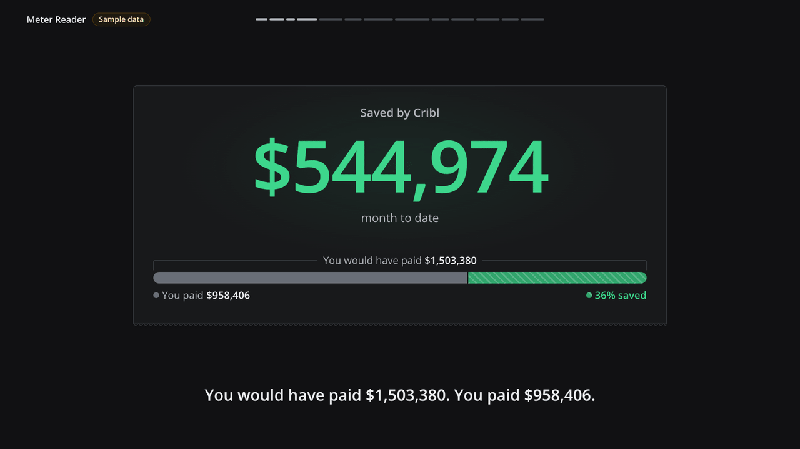
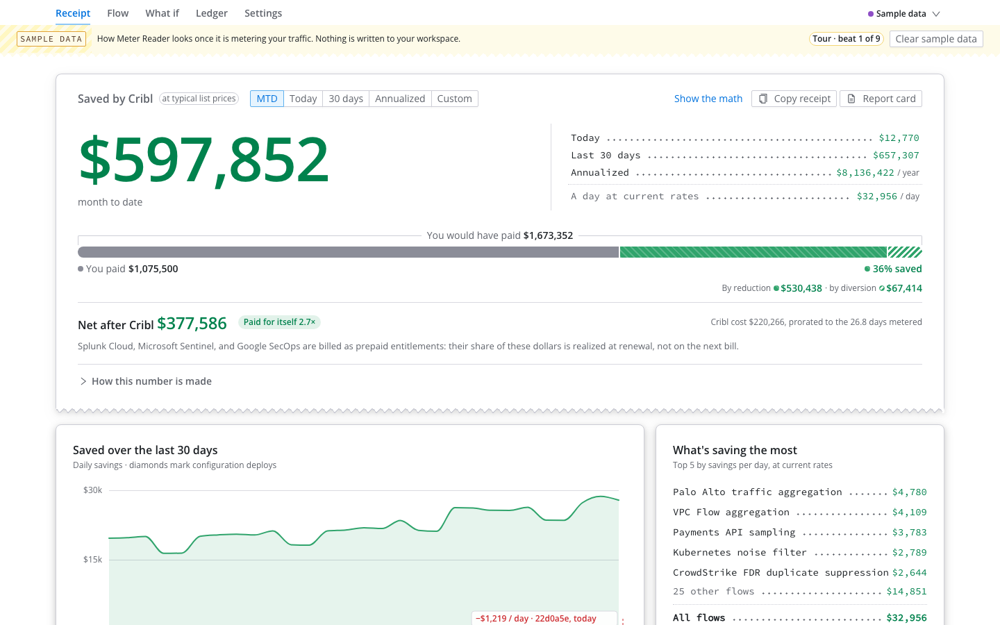
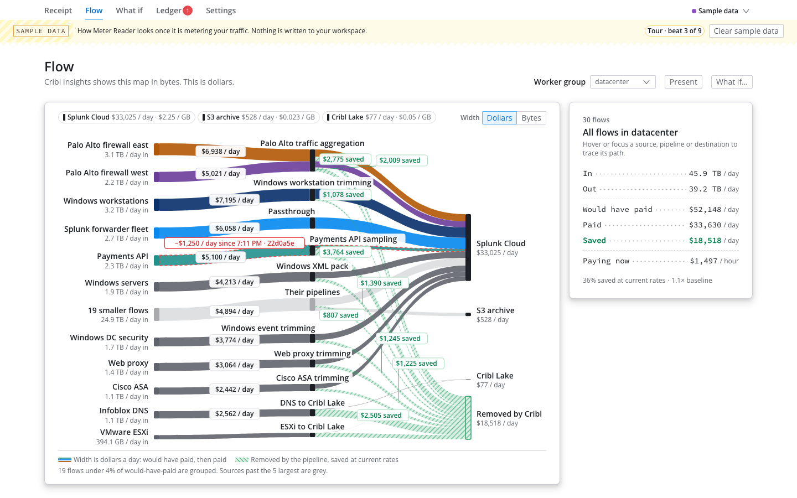
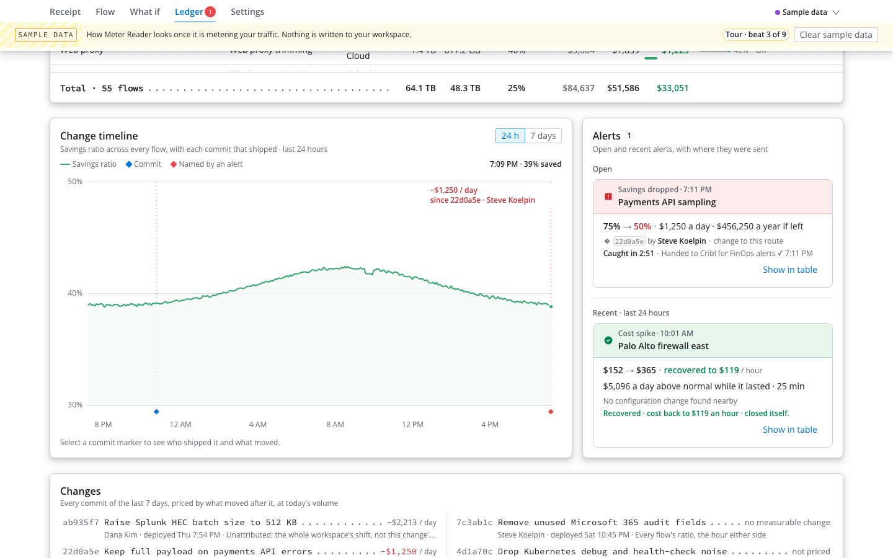
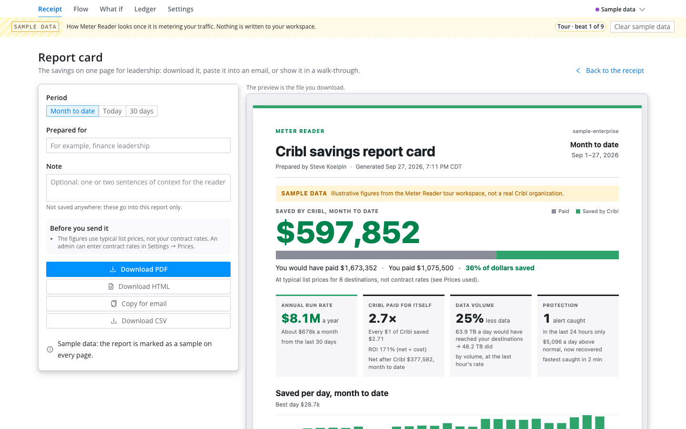

# Meter Reader

**Reads the meter. Sends the receipt.**

**$1.6M\* a year, projected**, for one Cribl pack (Palo Alto Networks) at 10 TB/day of firewall logs: 10,000 GB/day × $1.50/GB\* × 30% × 365 = $1,642,500\*. 30% is the top of the 15–30% Cribl publishes for this pack ([README](https://github.com/criblpacks/cribl-palo-alto-networks)) and the default in Cribl's ROI calculator. $1.50/GB\* ≈ Splunk Cloud's 5–10 TB/day list ($2.10\*) after an assumed volume discount; below Sentinel's 10 TB/day list ($2.22\*).

At your scale (Cribl's published 30%, $1.50/GB\*): 1 TB/day ≈ **$164K\*** · 5 TB/day ≈ **$821K\*** · 10 TB/day ≈ **$1.6M\*** a year. For ingest-priced Splunk contracts the saving lands at renewal (a smaller entitlement) or as growth you no longer buy; workload-priced (SVC) contracts don't save per GB.

\* For demonstration purposes only. Does not reflect actual prices.

Built by **Steve Koelpin**.

Join the Cribl Innovators Network — a community for Cribl builders: https://www.linkedin.com/groups/13052739

**▶ Watch the 6-minute walkthrough:** https://youtu.be/_4KhXD4fvTk



## Summary

Meter Reader prices every Cribl Stream flow at its destination and shows what Cribl saved, in dollars. It prices every commit, good or bad; when one erodes the savings, an alert in the Cribl bell and your notification targets names the commit and its author. What if forecasts a pack before you apply it ([what is new](#what-is-new-here)). It never changes pipeline, route, source or destination configuration. For Cribl platform owners, admins and their leadership.

**Measured live** (demo profile, generated traffic): a broken trim was caught in **1:27 to 2:13** (median 1:43) and closed itself 79 to 131 seconds after the fix was deployed.

|  |  |
|---|---|
|  |  |

## Try it

### Before you install

- **Cribl:** a Cribl.Cloud workspace on any plan, Standard included, with at least one Stream worker group sending data (the sample tour needs none; with no traffic yet, the [Datagen test flow](#no-traffic-yet-a-datagen-test-flow) makes some, no tag needed). Built and measured on Cribl 4.20.1.
- **Role:** an **Organization administrator** installs and shares the App (Cribl's [Apps admin guide](https://docs.cribl.io/apps/admin-guide/): only Organization administrators can install Apps). An administrator creates any Cribl notification targets. Members open it once it is shared with them (step 2).
- **What it asks for:** configuration and version reads, the metrics query, the pipeline preview dry run and four create-only notification writes, each argued in [Cribl API endpoints](#cribl-api-endpoints). No external host, no backend, and no credential to enter.
- **Limits:** the release meters only while a Meter Reader tab is open, and catches up from Cribl's metrics history when one is opened again; metering with no tab open needs the runner you host or the Enterprise variant. The rest are in [Known limitations](#known-limitations).
- **Upgrades** keep the App's KV data (measured: the demo organization's metering history survived every upgrade from 1.0.1 to 1.0.16, [`docs/LIVE_VALIDATION.md`](docs/LIVE_VALIDATION.md)). Cribl's Apps admin guide says an upgrade also preserves the App's **Share** settings (not yet re-measured here).

### Install and first run

For an **Organization administrator** on any Cribl.Cloud plan, Standard included:

1. **Install.** Download [`release/meter-reader-1.1.4.tgz`](release/meter-reader-1.1.4.tgz) from this repository's `release/` folder (its sha256 is in `release/SHA256SUMS`), or build it with `npm run package:release`. In Cribl, open **Apps** and choose **Import from File**: under **Build my own App ▾** on a workspace with no Apps yet, under **Add App** once one is installed. Choose the file, leave the App ID blank and Overwrite off, and select **Import**. The Review App screen lists what the App may call, 17 Cribl API permissions: reads, the metrics query, the pipeline preview dry run and four notification writes, each explained in [Cribl API endpoints](#cribl-api-endpoints). Select **Install**. The release declares no external host and no backend, so it installs on every plan.
2. **Share it.** In Cribl, open **Apps**, open Meter Reader's row menu (⋯), select **Share**, give **App user** to the members or teams who should open it on the **Members** and **Teams** tabs, and save (the steps in Cribl's [Apps admin guide](https://docs.cribl.io/apps/admin-guide/)). The members it is shared with get the grants listed in [Cribl API endpoints](#cribl-api-endpoints) while they use the App, so share it with the platform team.
3. **Tour with sample data.** Open Meter Reader. On a workspace with no prices yet, the first-run card offers **Tour with sample data**: a recorded month at enterprise scale plays on the Receipt under a "Sample data" band in about two and a half minutes. The counter runs, then a savings regression lands with its commit and author, then its delivery, a cost spike, the recovery and the weekly receipt, each as a note you can follow (**View in Ledger** opens the incident). The Flow map, the Ledger, What if and Settings show the same sample while it plays, and write nothing. **Clear sample data** ends it. `Y` plays the 90-second Story mode instead, which walks through every view by itself.
4. **Set one price.** Open **Settings → Prices**. Every destination in the workspace is listed with a suggested vendor preset (a sourced typical list price, never a vendor quote); until the first price is saved the list re-reads your destinations every minute and when the tab regains focus, so one you add in Cribl appears within a minute. Enter your contract rate in $/GB, choose what the data would have cost without Cribl (same destination, another destination, or nowhere) and select **Start the meter** (the button reads **Save changes** once prices exist). Metering starts the moment prices exist (the open tab waits for them, so nothing is counted at $0): the first sweep also collects up to the last day from Cribl's metrics history (a whole day for an estate of up to about 80 flows, about five hours for 400, never under an hour; a retry after the Leader rate-limited the first attempt reaches back the hour), priced at the price you just set (D25), learned from and never alerted on. Until a whole day is metered, the Receipt's **Projection** pill says how many hours of traffic the yearly figure rests on. Later price changes apply only from their own effective time.

   > **No traffic yet?** Build the [Datagen test flow](#no-traffic-yet-a-datagen-test-flow) below first: a Datagen Source is metered like any other, with no tag. **DevNull suggests the Internal / free preset, which prices it at $0**, so type a $/GB into its row (for example `1.50`); a flow priced at $0 saves $0.

5. **Alerts arrive in the Cribl bell, with no setup.** Every alert of medium severity or higher is posted to the notification bell in the Cribl header. To see one now: **Settings → Where to send alerts → Cribl notifications (bell) → Send a test alert**, then open the bell.
6. **Optional: connect a Cribl notification target.** To reach Slack, PagerDuty, email or a webhook, an administrator creates a notification target in Cribl (**Settings → Notification targets**); its URL, key or password stays in Cribl. In Meter Reader, select **Add endpoint** under **Where to send alerts**, select **Load targets** and pick the target (or type its id in **Target id**), select **Connect** (a confirmation names the two small Cribl Search objects it creates, a saved search that never runs and one notification), then **Send a test alert**. A confirmed **Connect** keeps the endpoint at once, so leaving Settings never loses it; **Save changes** is for later edits (an endpoint whose name is a web address stays a draft until the name is fixed and saved). Meter Reader stores only the target's id: no build stores a webhook URL, a key or a password (D57).

#### No traffic yet? A Datagen test flow

Any Stream traffic works. On a workspace with none, Cribl's own objects make a flow that saves, in one **Commit & Deploy**. Meter Reader meters a Datagen Source like any other Source: no tag, no naming rule.

1. **Source.** In the worker group, add a **Datagen** Source with one of its bundled samples (for example `syslog.log`) at about 1,000 events a second, about 10 GB a day, so the dollars are readable.
2. **Pipeline.** Add a pipeline with one **Drop** function, filter `Math.random() < 0.5` (or one **Sampling** function), so Cribl removes about half the bytes. A flow whose pipeline removes nothing is metered too, and saves $0.
3. **Route.** Add a route with the filter `__inputId=='datagen:SOURCE_ID'` (your Source's id), that pipeline and the output `devnull:devnull`, turn **Final** on and move it above the default route. Then **Commit & Deploy**.
4. **Price DevNull.** In Meter Reader, open **Settings → Prices**. DevNull's suggested preset is **Internal / free**, which prices it at $0, so type a $/GB into its row (for example `1.50`), keep **This destination** and select **Start the meter**. The first sweep back-fills from Cribl's metrics history, so the Ledger lists the flow with its reduction and dollars after that sweep (about 9 seconds after **Start the meter** on a fresh Cribl.Cloud workspace, measured with 1.1.0, [`docs/LIVE_VALIDATION.md`](docs/LIVE_VALIDATION.md)).

### Install

Download [`release/meter-reader-1.1.4.tgz`](release/meter-reader-1.1.4.tgz) → **Apps** → **Import from File** (under **Build my own App ▾** on a workspace with no Apps, **Add App** otherwise) → **Import** → **Install** → open **Meter Reader** → **Tour with sample data** to see everything immediately, or **Settings → Prices** to meter your own flows (no traffic yet? the [Datagen test flow](#no-traffic-yet-a-datagen-test-flow); DevNull is priced $0 until you type a $/GB). Alerts land in the Cribl bell from the first one.

**Required role:** an **Organization administrator** (see [Before you install](#before-you-install)).

### Configuration

Everything is set under **Settings** and kept in the App's KV (`settings`, and `prices` for prices), so it applies to everyone the App is shared with: every setting is per App, not per member. Only a price is required.

| Section | Required | Default | What it sets |
|---|---|---|---|
| **Prices** | yes, at least one destination | a suggested vendor preset per destination type, shown but not saved until you save it | $/GB per destination and the counterfactual (this destination, another one, or nowhere), versioned with an effective time and the member who saved it |
| **Budgets** | no | none | a monthly budget per destination, for the Budget pace alert |
| **Cribl cost** | no | none; a suggestion at Cribl's published list price for the ingest measured here | the monthly Cribl cost behind net saved and the payback multiple, and an optional monthly savings goal |
| **Alerts** | no | the rules in the [alerts table](#screens-alerts-and-receipts); good news off | thresholds, good news, and the objects muted or left out of metering |
| **Where to send alerts** | no | the Cribl bell, on for medium severity and up, weekly receipt on | the bell's switch and minimum severity, Cribl notification targets (stored by id), and which endpoints get the weekly receipt |
| **Runtime** | no | this browser tab | which runtime meters, the last sweep, **Sweep now** and the installed version |

No setting takes a webhook URL, a token, a key or a password; the one link `settings` holds is the presenter QR code's public page.

### Uninstall

1. In Cribl, open **Apps**, open Meter Reader's menu and delete it (confirm). That removes the App and its KV store: settings, prices, rollups, incidents and the delivery log.
2. Meter Reader never deletes anything outside its KV, so what **Connect** created stays in Cribl Search: in the `default_search` group, delete the saved search `meter_reader_alert_relay` and its `meter_reader_relay_*` notification(s).
3. Bell messages Meter Reader posted stay in the Cribl bell until an administrator clears them.
4. A runner you host stops with its process (Ctrl+C, or its service manager) and keeps nothing but its own `.env` and log.

## What it does

Every Cribl customer bought Cribl to save money. Every admin can feel the savings; almost nobody can show them. Monitoring and Cribl Insights speak in bytes, leadership thinks in dollars, and the proof gets rebuilt in a spreadsheet the week before renewal.

**Meter Reader turns Cribl's throughput into a receipt.** It prices every flow at the destination it feeds, against a counterfactual you choose (the same destination, another one, or nowhere), works out what Cribl cut, sampled or diverted before the meter ran, and shows one number: **Saved by Cribl**. Admins see the same money by source, route, pipeline and destination, drawn against the commit timeline, so a drop in savings arrives with a commit ID and a username on it. When a change quietly erodes the savings, a source suddenly costs more, or a destination is pacing past its budget, Meter Reader raises an alert in Cribl's own notification bell and, through the notification targets an administrator already set up in Cribl, in Slack, PagerDuty, email or a webhook; and once a week it sends leadership the receipt the same way (on schedule from the runner or the Enterprise variant; from the release, the first time the App meters after Monday 12:00 UTC, any day that week, marked late after the first 24 hours; each only for a week metering reached). It never changes pipeline, route, source or destination configuration: it reads, prices and posts alerts through Cribl.

**Supported:** Cribl Stream worker groups on Cribl.Cloud, any plan (built and measured on Cribl 4.20.1, Standard plan). The release runs in the member's browser tab; the optional runner and the Enterprise variant meter with no tab open ([Runtimes](#runtimes)).

### When to use

- **Before a renewal, a QBR or a budget review:** show leadership in dollars what Cribl saves, without rebuilding the proof in a spreadsheet (the Receipt, the Report card, the weekly receipt).
- **After a pipeline or route change:** know within minutes when a change quietly costs money, which commit did it and who shipped it; a good change is credited the same way (the savings-regression alert, the Ledger's change timeline and **Changes**).
- **When a source or a destination runs hot:** a cost spike, or a destination pacing past its monthly budget, in dollars.
- **Before changing configuration:** what a pack or a drop percentage would save on one stream, priced at its destination (What if).
- **Not for:** Cribl's own bill (credits and invoices are in Cribl's FinOps Center), or changing configuration: Meter Reader reads, prices and alerts, and only a demo build pulls levers.

### Screens, alerts and receipts

**Screens**

- **Receipt**, the leadership view and the default landing: **Saved by Cribl**, ticking, with a period toggle (month to date, today, last 30 days, annualized run rate). A new install opens on the **annualized run rate**, labelled a projection (a Projection pill and how many minutes or hours of traffic it rests on) until it rests on a full day; a workspace that stored month to date as its default keeps it (`settings.headlinePeriodDefault`, never migrated: a workspace upgraded from 1.1.0 or 1.1.1 that saved any setting stored it); "You would have paid $Y · You paid $Z" and the savings ratio; net saved and a payback multiple when a monthly Cribl cost is set (with none set, both are shown as an estimate labelled with its basis, Cribl's list price per GB times the ingest measured here, and a link to set the contract cost; nothing is stored); a 30-day trend with deploy markers; the five biggest savers in plain English; where the money goes, per destination; **Show the math**; **Copy receipt**.

  On a wide screen the other periods sit beside the number as receipt lines, each a button that switches to it, with what a day saves at current rates, and one chip says whether the dollars are **at your contract rates** or **at typical list prices**. An optional monthly savings goal (**Settings → Cribl cost**) adds a pace strip to month to date. **This week so far** sets Monday to now against the same days last week and previews Monday's message as it would read if it were sent now. Every destination under "Where the money goes" opens its **statement**: this month and last, its budget pace, the prices that applied, and when in the week it saves, hour by hour over the last 7 days. **Custom** sums any window, and **Compare with…** sets it beside the previous period, the same window a week earlier, or the time before a commit, with both figures, the signed change and **What moved** (`?vs=`; see [Custom range](#the-money-model)).

- **Report card** (`/report`, the **Report card** button on the Receipt): the savings for leadership, summarized on one page, for the period on the Receipt (month to date, today, the last 30 days, or its custom range), with an optional "Prepared for" and note that are never saved. Downloads as a PDF (US Letter: a one-page executive summary, then pages of detail; the sample's eight destinations take three pages), a self-contained HTML file that prints cleanly, or a CSV of every flow and destination for a spreadsheet; **Copy for email** pastes it into Outlook or Gmail as a formatted table with a plain-text twin. The preview on screen is the downloaded file itself.

- **Presenter** (`?present=1` or `P`): the annualized run rate at projector size, the top savers and a QR code. When a high-severity incident opens, the incident card slides up with the before and after ratio, $ per day (and a year if left, for an open regression), the commit, the author and a live "Caught in m:ss" clock.

  Under the hero, **Saved since you started watching** counts up from the moment the stage opens, at the measured rate, on live data only (it freezes when the data is not live). At rest the lower half holds the month's receipt bar at stage scale and the completed days' savings as one line, and steps aside when a card lands. The red card counts **Lost since the deploy** as it happens and keeps the figure on the green card as what it cost before it recovered; with the session line these are the only money shown in cents. Both cards draw the drop: the ratio by minute, the dashed baseline, the deploy's diamond and the shaded loss. `M` turns a chime on or off for the session. `?story=1&stage=1` is the booth loop: Story mode on the dark stage, full screen from the first click, the cursor hidden while it is still, looping until a key.

- **Flow**: Source → Pipeline → Destination as ribbons sized by dollars (the square root of what each flow would have cost a day) and labelled in dollars per day, with the saved wedge cut into each ribbon. Its subtitle says why it exists: "Cribl Insights shows this map in bytes. This is dollars."

  **Width: Dollars | Bytes** morphs the map Insights draws into the dollar map (`?weight=bytes`). **Present** (or `F`, `?stage=1`) puts the map on a projector with the receipt as a strip; `P` or Esc brings it back. A hatched **Removed by Cribl** sink pools what the pipelines removed, an open alert outlines its ribbons with its dollars a day, since when and the commit, and destination chips isolate their paths.

- **What if**: projects what a pack or a drop percentage would save on one stream before anyone touches config, with the basis named in the math, strongest first: a dry run of the treatment's pipeline on the Source's own sample events through Cribl's preview API (Datagen Sources; within 0.02 of the true ratio on every rig pipeline; a Source with no sample of its own can be measured on a sample another Datagen Source in the same worker group generates from, which the member picks and the math names), the measured ratio of a similar stream in this workspace, or the pack's documented range. The release only projects; applying a treatment exists only in the demo build.

  The treatments are tiles with their documented ranges and where each already runs here, and **Biggest unclaimed savings** ranks every stream with the next pack written for it by what it would add a year; a line loads that pair into the calculator. With good news on (see [Alerts](#what-it-does)), a change that raises the savings lands on the presenter view as a green card, and one applied from What if in the demo build prints its projection beside the measured ratio.

- **Ledger**: every flow with bytes in and out, reduction, would-have-paid, paid, saved per day and a 60-minute sparkline; the change timeline with commit markers; the incidents rail with delivery status per channel.

  Every commit is priced where anything measures it: its card on the change timeline carries what it is worth a day since the deploy and the basis of that figure (or says nothing measures the change on its own), and **Changes** lists every commit of the last 7 days as receipt lines, largest first, adding up to a net, so a good deploy is credited by the same mechanism that blames a bad one. A drop whose alert closed by recovering, and the later change that undid it, are listed with what happened ("Recovered …, reverted by …", "Undid …") and left out of the net and out of the largest priced change. Under the Receipt's custom range (`?range=`) the money columns, totals and strip sum that window.

- **Settings**: prices with vendor presets, auto-suggest and the per-destination counterfactual (every change is versioned with an effective time, so history is never repriced); budgets; Cribl cost (with a suggestion at Cribl's published list price for the ingest measured here, which an administrator can take or replace with the contract figure); alert thresholds; where to send alerts, with a test per channel and **Send the last 7 days now**; **Sweep now** with the last sweep's call count and duration.

  Each price row shows a live receipt, the last sweep's volume at the price being typed, in dollars a day, and the card shows the receipt those prices would print. Presets are vendor tiles, and every price version names who saved it, with a **Price history** per destination.

- **Everywhere**: `Ctrl+K` or `⌘K` opens a palette that finds every tab, Settings page, source, pipeline and destination by the names the App shows, and runs every action (the presenter view, Story mode, the booth loop, the Ledger search, the report card, **Sweep now**, diagnostics), with single-key shortcuts on or off.

- **First run and Story mode**: the tour for an empty workspace, and a 90-second self-narrating loop (`?story=1` or `Y`) for a booth, a phone, or a room nobody is narrating. Both run in the release on sample data, under the band; the tour lives in the URL (`?tour=1`), never in KV, so a reload or the presenter keeps it.

**Alerts** (detect and notify, never act)

| Alert | Default rule | Severity | What the notification carries |
|---|---|---|---|
| Savings regression, with change | a route or pipeline's savings ratio drops 15 points or more below its 24-hour baseline for 3 minutes, costs at least **$5 a day** (D26), and a commit landed in the 30 minutes before | high | object, ratio before and after, $ lost per day and, while it is open, a year if left, commit hash, message, author, deploy time |
| Savings regression, no change found | the same drop and the same $5-a-day floor with no commit nearby | medium | object, ratios, $ lost per day and, while it is open, a year if left, "no config change found" |
| Cost spike | a source's $ per hour sits 3 standard deviations above its baseline for 2 minutes and at least $5 an hour higher | medium; high at twice the baseline or more | source, extra $ per hour, and per day above normal while it lasts (never a year) |
| Budget pace | a destination's projected month-end spend reaches 90% (warn) or 100% (alert) of its budget, once the month has a day of metering behind the projection | medium; high at 100% after three days of metering | destination, month to date, projection, days left |
| Good news (off by default; on under the demo profile) | a commit followed by a ratio rise of 15 points held for 3 minutes (1 under the demo profile) | info | "your change is saving $X/day", commit, author |

Recovery closes an incident by itself and sends a recovery notice, which gives what it cost a day above normal while it lasted, for how long and about what it came to in all, and is never annualized: only an open regression is priced a year ahead, as its cost if left unfixed, on the bell, a notification target, Slack and ServiceNow as on the App's cards (D62). A member can also close one from its card: **Accept as the new normal** (the baseline re-learns that level), **Mute for 24 hours** (nothing new opens on that object until then), or **Leave out of metering** (**Settings → Alerts** brings the object back); a budget alert offers mute and leave-out only. There is one open incident per type and object, re-notified at most hourly unless its severity rises. Every threshold is a setting. The $5-a-day floor exists because a 30-point drop on a $1-a-day archive flow opened a high-severity incident on the live rig; a regression whose per-day figure is unknown is not held to it. Good news is off until a member turns it on (**Settings → Alerts → Good news**), with one exception: the demo profile (demo mode on, which only the demo build's **Settings → Demo** or the runner's `--setup --demo-org` switches on) runs the rule whatever that switch says, without changing it, so on stage a pack applied by a lever opens a good-news card once its rise holds; the release build puts that card on the presenter view only when the switch is on.

**Where alerts go**

| Channel | Setup | Where it works | What the App stores |
|---|---|---|---|
| **Cribl notification bell** | none: on by default for medium and up; switch it off or raise its minimum severity in Settings | every runtime | nothing extra |
| **Cribl notification target** (Slack, PagerDuty, email, Amazon SNS, webhook) | an administrator creates the target in Cribl; a member picks it and confirms **Connect** | every runtime on Cribl.Cloud | the target's id only; its secrets stay in Cribl |
| **Direct webhook** (Slack Block Kit, generic JSON or ServiceNow) | the URL in the runner's own git-ignored `.env` (`MR_WEBHOOKS`), never in the App | the runner only | nothing but its name and host (in `meta`, so Settings and the incident cards can say where an alert went); no build stores a webhook URL (D57) |

**Report card.** What an admin or a sales engineer hands to a CFO: Saved by Cribl for the period in dollars, would-have-paid against paid and the share of dollars saved; the annual run rate; **Cribl paid for itself N×** with the net after Cribl, when a monthly Cribl cost is set; the data volume before and after Cribl as a separate, labelled share (dollars and volume are never one bare "%"); the alerts that protected the savings, with how fast they were caught and the commit behind them; the top savers and every destination with the price it was billed at; how the numbers are made, including what is not counted; and the prices behind them with their typical ranges and sources. Page 1 says whether the prices are typical list prices or rates an admin entered, and the view lists what to fix before sending (list prices instead of contract rates, no Cribl cost, an unpriced destination) rather than printing it on the document. Every page says which workspace, when it was generated (local time and UTC), who metered it and the Meter Reader version; a report built from sample data is watermarked on every page. Nothing is sent anywhere: the files are made in the browser and saved by the viewer.

**Weekly receipt.** Last week's Saved by Cribl, would-have-paid against paid, the top savers, the week-over-week trend and any open alerts. It goes through the same channels as alerts, to every enabled endpoint with **Weekly receipt** on (the bell included, by default): as a bell message, as plain text to a notification target, or, from the runner, as Slack Block Kit or JSON to a direct webhook. It is sent once after Monday 12:00 UTC (8 AM ET) by whichever runtime is metering: the first time the App is open that week, the runner's Monday send, or the Enterprise variant's schedule. Whenever in the week it goes out, it covers the week before that Monday, and one sent more than a day after Monday 12:00 UTC says it was sent late. It is sent only for a week metering reached (D83): the first sweep records when metering started (`meta.meteringStartedAt`), so a fresh install gets no receipt for the week before it, even though that sweep back-fills up to a day of history, and a workspace that began mid-week gets its part, its bell line saying how much of the week was metered. **Settings → Where to send alerts → Send the last 7 days now** sends the seven days before today on demand and reports each endpoint's result, and `npx tsx scripts/runner.ts --weekly` does the same from the runner. Leadership gets the number without logging in to Cribl. **Copy receipt** on the Receipt view copies the receipt for the period on screen as text. A sample (example numbers\*):

```text
Meter Reader — weekly receipt    Sep 21–27, 2026
Windows event trimming ................   $9,380
Firewall duplicate suppression ........   $6,384
Kubernetes noise filter ...............   $4,480
Payments API sampling .................   $2,716
CDN log aggregation ...................     $847
------------------------------------------------
Saved by Cribl, last week                $23,807
Would have paid $39,678 · Paid $15,871
60% saved
vs. prior week: +4%
Open alerts: 1
  Savings dropped: Payments API sampling

         Meter Reader by Steve Koelpin
```

## How it uses the platform

The release uses two platform capabilities: **documented Cribl APIs** (configuration and version reads, the metrics query, the pipeline preview, the notification bell, notification targets and the Search notification relay) and the **App KV store**. The optional Enterprise variant adds a third, **backend functions on schedules**. No build declares a proxy host: alerts leave through Cribl's own notification services, which keep every secret in Cribl (D23, D57).

### Permissions and external access

The release asks for exactly the grants in [The minimal policies.yml](#the-minimal-policiesyml). [Cribl API endpoints](#cribl-api-endpoints) argues each one, then says what a member the App is shared with could do with them and what an administrator should know before sharing it. **External access: none.** No package declares a proxy host or calls a service outside Cribl ([Proxy hosts](#proxy-hosts)): alerts leave through Cribl's own notification bell and notification targets, whose secrets stay in Cribl. The optional runner, which you host, is the one runtime that posts to a direct webhook, from URLs in its own `.env`.

### Cribl API endpoints

In the release, every call runs as the signed-in member through the platform's fetch proxy, which scopes it to the App and grants what `policies.yml` declares for members an administrator shares the App with. The runner makes the same calls with the org API credential it is given.

| Method | Endpoint (policy object) | What Meter Reader does with it | In the bundled OpenAPI spec (Cribl 4.20.1)? |
|---|---|---|---|
| GET | `/products/stream/groups` | Lists the Stream Worker Groups to meter | Yes (`/products/{product}/groups`) |
| GET | `/m/:gid/system/inputs` | Sources: type, state and description, for the flow walk | Yes (`/system/inputs`, group-scoped) |
| GET | `/m/:gid/system/outputs` | Destinations: the list the Prices page shows and prices | Yes (`/system/outputs`, group-scoped) |
| GET | `/m/:gid/pipelines` | Pipelines on each route, for names and labels | Yes (`/pipelines`, group-scoped) |
| GET | `/m/:gid/routes` | The routing table, walked into priced flows (filters, pipeline, output, final) | Yes (`/routes`, group-scoped) |
| GET | `/m/:gid/version` | Commit history per group: hash, message, author, time | Yes (`/version`, group-scoped) |
| GET | `/m/:gid/version/show` | One commit's full message, when changed files are unavailable | Yes (`/version/show`, group-scoped) |
| GET | `/m/:gid/version/files` | Files one commit changed, so a regression is matched to the commit that touched that pipeline | Yes (`/version/files`, group-scoped) |
| POST | `/system/metrics/query` | Bytes and events per input, output and route, per minute. A read despite the verb | Yes: `createSystemMetricsQuery`, `x-cribl-internal: false`, also listed in the public [Cribl Core API reference](https://docs.cribl.io/cribl-as-code/api-reference/control-plane/cribl-core/) under Diagnostics and Monitoring |
| GET | `/m/:gid/system/samples/:id/content` | What if, only when a member selects the dry run: reads the sample file a Datagen Source generates from, so the treatment can be run on that Source's own events, or, for a Source with none, on a sample another Datagen Source in the same worker group generates from, which the member picks and the math names (at most 200 events, under 90 KB) | Yes: `getDataSampleContentById` (`/system/samples/{id}/content`, group-scoped) |
| POST | `/m/:gid/preview` | What if, only when a member selects the dry run: runs the treatment's pipeline over those sample events (`mode: 'pipe'`) and compares bytes in and out. Cribl runs it in a throwaway process and saves nothing. The grant itself cannot restrict the mode, and Cribl's `routeAndSend` mode would deliver the sample events to Destinations; Meter Reader never sends it | Yes: `createPreview` (`/preview`, group-scoped), `x-cribl-internal: false` |
| POST | `/system/messages` | Posts each alert to the Cribl notification bell, one message per alert state; never updates or deletes one | Yes: `createBulletinMessage`, `x-cribl-internal: false` |
| GET | `/notification-targets` | Lists the notification targets an administrator configured, for the Settings picker; keeps only id, type and description | Yes: `getNotificationTarget` |
| GET | `/m/default_search/search/saved/meter_reader_alert_relay` | Reads the alert relay saved search, to show whether a target is connected. Literal segments: this one saved search in the Search group, no other | Yes: `getSavedQueryById` (Cribl.Cloud only) |
| POST | `/m/default_search/search/saved` | Creates the never-scheduled relay saved search, only when a member confirms **Connect** | Yes: `createSavedQuery` (Cribl.Cloud only) |
| POST | `/m/default_search/search/saved/meter_reader_alert_relay/notifications` | Creates one relay notification per target, only when a member confirms **Connect**. Literal segments: notifications can be attached to the relay only | Yes: `createSavedQueryNotificationsById` (Cribl.Cloud only) |
| POST | `/search/notifications` | Hands one alert to Cribl's notification service for that target. Leader-level: the one `/search/` path that is not under `/m/default_search` (measured) | Yes: `createSearchNotifications` (Cribl.Cloud only) |
| GET, PUT, DELETE | `/kvstore/{key}` | The App's own documents (below). DELETE only expires the App's own dated rollup and incident keys | App-scoped; Apps Builder Guide. Granted automatically, not declared |
| POST | `/kvstore/keys` | Lists the App's dated keys by prefix, for retention | App-scoped; granted automatically |

A 401 or 403 on any call is shown where it happened ("Couldn't read metrics for default: your role can't view them. Ask an administrator for Monitoring access."), with that section's actions disabled and the rest of the view intact.

**What the release can write in Cribl.** Besides its own KV documents, exactly four POSTs (D30, enforced by `NOTIFICATION_WRITES` in `tests/compliance.test.ts`): a bell message; the relay saved search and one notification per target, both only after a confirmed **Connect**; and a forwarded alert. Meter Reader's code only creates: it never replaces or deletes anything, and nothing in the App ever deletes a bell message. The grants themselves allow any body. The metrics query and the preview are POSTs that change nothing.

**What a shared member could do with these grants.** A grant names a path and a method, never a body, and the platform grants every declared path to each member the App is shared with, for any request made through the App's API scope, not only for the requests Meter Reader's code makes. So a member who calls those paths directly could post any message to the Cribl bell (`POST /system/messages`), create any saved search in Cribl Search, scheduled or not, and the saved-search schema lets that saved search carry its own notifications to a notification target an administrator already configured (`POST /m/default_search/search/saved`; not tried live), attach a notification to Meter Reader's relay saved search and to no other saved search (`POST /m/default_search/search/saved/meter_reader_alert_relay/notifications`), and forward any text to the targets of any Search notification in the workspace, not only the relay's (`POST /search/notifications`), as measured with a notification on another saved search ([`docs/NOTIFICATIONS.md`](docs/NOTIFICATIONS.md) §2.3). None of the four can replace or delete an existing Cribl object (a POST with an id that exists answers 409), and none can create a notification target. The relay's paths are literal, not `:gid`/`:id` placeholders, so the read and the notification grant reach the relay alone; the create and the forward cannot be narrowed by path, because Cribl's own APIs take the new saved search and the notification id in the body. Share the App with people you would trust with those four actions.

**What an administrator should know before sharing the App.**

- **The Source and Destination reads return secrets, decrypted.** `GET /m/:gid/system/inputs` and `GET /m/:gid/system/outputs` answer with every Source's and Destination's full configuration, and on Cribl 4.20.1 that includes credentials in plain text (measured: a Splunk HEC Source's auth token). Meter Reader keeps only each object's id, type, state, description and pipeline links and never stores or shows anything else, but the grants let any member the App is shared with read those configurations, secrets included, through the App's API scope. Share the App with the platform team, the people who could already read that configuration in Cribl.
- **`GET /notification-targets` returns each target's full configuration**, including a Slack or webhook URL in plain text. Meter Reader keeps only the id, type and description and never stores or shows the rest, and it asks for the list only when a member presses **Load targets**, but the grant lets any member the App is shared with read those configurations through the App's API scope. The release keeps this grant for the target picker: the Source and Destination reads above already put more sensitive configuration in the same members' reach, so it does not change who the App should be shared with. Without it, members would type the target id, which the editor also accepts; dropping it is one grant and the **Load targets** button.
- **What has been proven, and as whom.** Every notification call above was proven live with the organization's admin API credential (through the runner and by hand, [`docs/NOTIFICATIONS.md`](docs/NOTIFICATIONS.md)). The Leader accepted the literal relay grants at install: demo builds 1.0.11 through 1.0.16, whose `default/policies.yml` carries the same three literal `default_search` paths as the release, installed and ran on the build organization on 27 September 2026 ([`docs/LIVE_VALIDATION.md`](docs/LIVE_VALIDATION.md)). Whether the App proxy honors the grants for a non-admin member (an administrator bypasses the policy matcher) is the last check of the clean-install test, logged in the same file. If the App proxy refuses a member, the Settings test reports "Cribl refused the request (403)" and the runner still delivers.

### Data and storage

- **Stores:** only in the App's own KV store: settings, prices, the latest sweep, per-flow rollups by minute, hour and day, incidents and the delivery log. [KV keys](#kv-keys) lists every key, who can read it and how long it is kept. No credential is stored (D57).
- **Reads:** Cribl configuration (Sources, Destinations, pipelines, routes), commit history and throughput metrics, keeping ids, names, descriptions, pipeline links, commit hashes, messages and authors, and byte and event counts. It reads no event data, except the sample events of a What if dry run, which are priced and not kept.
- **Changes in Cribl:** it posts bell messages and, after a confirmed **Connect**, creates one never-scheduled saved search and one notification per target in Cribl Search. It never changes pipeline, route, source or destination configuration.
- **Cleanup:** once an hour the sweep expires the App's own dated rollup and incident keys (`roll/*`, `incidents/*`, with their chunks) once they pass the retention below, with a KV `DELETE`: the only DELETE the App issues, housekeeping on data it derived and wrote itself, never a member's settings or prices and never anything in Cribl (D64). A rewrite never deletes: a shorter document leaves its old chunks for the next longer write to overwrite, and a reader reads only the chunks its manifest names. Deleting the App deletes its KV; what **Connect** created and the bell messages stay until removed by hand ([Uninstall](#uninstall)).
- **Limits:** about 115 keys at a year old against the store's default cap of 1,000, and every value under the Leader's limit of about 100 KB (larger documents are chunked).

### KV keys

All values are plain JSON strings scoped to this App. **Who can read them:** anyone in the organization who can use this App's KV API, which in practice means the members the App is shared with; other Apps cannot. **No credential is stored in KV, in any build** (D57): no webhook URL, token, key or password. Every write of `settings` goes through `core/settings.ts` `storableSettings`, which keeps only the bell and notification-target ids, and `tests/compliance.test.ts` checks it. Upgrades keep KV; deleting the App deletes it.

| Key | What it holds | Written by | Kept |
|---|---|---|---|
| `settings` | Timezone, thresholds, budgets, Cribl cost (and whether it was taken from the list-price estimate), a monthly savings goal, alert channels (the bell's switch and minimum severity, notification-target ids, and when a member confirmed that a target's test arrived), mutes a member set from an alert (object, until when, by whom), objects left out of metering, the names members gave API clients (keyed by the client id's last four characters), the single-key shortcuts switch (workspace-wide), presenter QR link, runtime | Settings; an alert's actions; the first tab to sweep a live workspace with no settings document (its zone, once; never on the tour or a replay) | 1 key |
| `prices` | Price versions per destination: $/GB in millicents, preset, counterfactual, effective time, and the Cribl username of the member who saved it (readable by every member the App is shared with) | Prices | up to 50 versions |
| `snapshot` | The latest sweep: headline, per-flow figures, top savers, unpriced destinations, the ticking rate | the sweep | 1 key, compacted to 90 KB |
| `meta` | Collecting since, metered through, last sweep time, calls and duration, who ran it (tab, runner or backend), last error, metering gaps, the rate-limit back-off (since, until, streak), app version and build, and the runner's direct webhooks by name and host (never their URLs) | the sweep | 1 key |
| `inventory` | The configuration the sweep walks, cached | the sweep, every 10 minutes or on a new commit | 1 key |
| `totals` | Running totals per local day and per destination month (headline, budget pace) | the sweep | 1 key |
| `roll/min/YYYY-MM-DDTHH` | One row per flow per minute: bytes, events, would-have-paid, paid, saved | the sweep | 25 hours |
| `roll/hour/YYYY-MM-DD` | Hourly rows per flow | the sweep | 32 days |
| `roll/day/YYYY-MM` | Daily rows per flow | the sweep | 13 months |
| `baselines` | EWMA mean and variance per object | the sweep | 1 key |
| `timeline` | Recent commits per group: hash, message, author, changed files, deploy time | the sweep; demo levers | 1 key |
| `incidents/YYYY-MM-DD` | Incidents and their deliveries per channel | the sweep | 31 days |
| `notify/log` | The last 200 delivery attempts with channel and HTTP status | the sweep, test sends | 1 key |
| `lock/meter` | The sweep lock: owner and expiry | the sweep | 1 key |
| `demo/state` | Demo build only: lever state, mutes, measured lag | demo levers | 1 key |

A document larger than 90 KB is stored as gzip and base64 in chunks at `KEY/c/N`, with a small manifest at the key itself, because the Leader refuses KV values above about 100 KB. By the retention above, an install a year old holds 113 to 117 keys (at most 12 single documents; 25–26 minute, 32–33 hour and 13–14 day rollup keys; 31–32 incident days), plus one key per 90 KB chunk of any larger document, against the default cap of 1,000. That figure is derived from the retention. Counted on the build organization with one `POST /kvstore/keys` listing on 27 September 2026 at 20:04 UTC, about 38 hours after metering began: 42 keys (11 single documents; 26 minute, 2 hour and 1 day rollup keys; 2 incident days), what the retention predicts at that age ([`docs/LIVE_VALIDATION.md`](docs/LIVE_VALIDATION.md)).

### Runtimes

**One core, three ways to run it.** The same `core/` sweep runs (1) in the open App tab, the release and the default; (2) in an optional runner you host, a small Node process with an org API credential that keeps metering with no tab open; and (3) as scheduled backend functions in the optional Enterprise variant, for workspaces with App backend compute.

All three call `runSweep()` in `core/sweep.ts`, so they can never disagree about a number, and all three hold the KV lock `lock/meter`, so any mix of them never counts a minute twice.

| Runtime | Where it runs | When it meters | How it authenticates | Alert channels |
|---|---|---|---|---|
| **The open tab** (the release; primary) | the App, in the member's browser | every completed minute while a Meter Reader tab is open (it checks twice a minute); when reopened it catches up from Cribl's metrics history, up to 24 hours in one pass | as the signed-in member, through the platform fetch proxy | bell, notification targets |
| **The runner you host** (optional; `scripts/runner.ts`, D24) | a small Node process on a machine you own | every minute, with no tab open, for as long as it runs | an org API credential in a git-ignored `.env` | bell, notification targets, direct webhooks from its `.env` |
| **The Enterprise variant** (optional; `meter-reader-1.1.4-backend.tgz`) | App backend functions on schedules | every minute | the App-wide grants in `policies.yml` | bell, notification targets |

- **The open tab** meters each completed minute once, and only after prices exist. A minute caught up after a gap keeps its true time, and an alert opened on it says it was caught on catch-up. It needs nothing beyond a standard Cribl.Cloud workspace. What it cannot do is meter while no tab is open; it fills that gap from history when reopened.
- **The runner** is what kept the demo organization metering around the clock: about 23 Leader calls and about 1 second per sweep, measured live. It is optional and customer-run: `npx tsx scripts/runner.ts` sweeps every minute (25 seconds after the boundary) and sends the weekly receipt once after Monday 12:00 UTC; `--once` runs one sweep and `--weekly` sends the receipt now. It is the one runtime that sends direct webhooks: their URLs live in its `.env` (`MR_WEBHOOKS`, comma-separated https URLs with an optional `slack:`, `generic:` or `servicenow:` prefix), it logs them at start by name and host, and only those names and hosts reach KV. It needs an API credential with rights to read the configuration and metrics, to write the App's KV (`/api/v1/a/meter-reader/kvstore`) and to use the notification calls above; it also reads the installed App's version (`GET /apps/meter-reader`) so the footer shows what is installed. See [`docs/RUNBOOK.md`](docs/RUNBOOK.md).
- **Who meters and delivers when both are running.** While a runner has swept in the last 90 seconds, an open tab does not sweep at all: it shows what the runner wrote (the footer says who metered), and starts metering again the moment the runner goes quiet. An open tab also leaves notifications to a runner or backend that completed a sweep in the last 90 seconds, so every alert goes out once, from the runtime that also posts the runner's direct webhooks. A failed delivery is retried per endpoint, by what it answered ([Retries, per endpoint](#alert-delivery)).
- **The Enterprise variant** is the same App plus the scheduled `meter` and `weeklyReceipt` functions; see [Backend functions and schedules](#backend-functions-and-schedules). It installs only on organizations with App backend compute.

### Alert delivery

`core/delivery.ts` routes every notification to its channel with one call shape (DECISIONS D27–D30, evidence in [`docs/NOTIFICATIONS.md`](docs/NOTIFICATIONS.md)):

- **The bell** (`POST /system/messages`). A bell message is write-once: re-posting its id answers 409 and it cannot be patched. So each alert state gets its own id (`meter-reader-INCIDENT-SEVERITY`, and `meter-reader-INCIDENT-closed` for the recovery), and a repeat of the same state is logged as delivered, "already in the bell". Severity high posts as `error`, medium as `warn`, and recoveries, good news and tests as `info`. On a Leader without the bell API, or one that refuses it, the default bell is skipped quietly once per sweep instead of recording a failed delivery nobody asked for.
- **Notification targets through a Search relay.** Cribl has no API that sends a custom message to a notification target (`POST /notification-targets/{id}/test` answers 405 for a webhook target), but its notification service forwards Search notifications. So **Connect** creates a never-scheduled saved search `meter_reader_alert_relay` in `default_search` and one notification per target, and each alert is forwarded with `POST /search/notifications`. Cribl delivers a forward only when its id starts with `SEARCH_NOTIFICATION_` plus the notification id; any other id, or a relay that does not exist, answers 200 and is silently dropped, so the router checks the relay first and logs `relay_missing` instead of forwarding blind. Cribl does not de-duplicate forwards, so a forward is not retried within a call; across sweeps the per-endpoint rule below applies, and a forward that timed out or answered 5xx is sent again, which can deliver it twice if the first one landed. The target receives a plain-text alert (title, money, commit, caught-in time, a link); a webhook target also receives the full alert as JSON under `meter_reader`. Each relay send also refreshes one bell entry titled "Notification" per relay. Measured live with a webhook target; Slack, PagerDuty, email and SNS targets use the same Cribl service but were not exercised.
- **Direct webhooks** (the runner only, from its `.env`; D57). The Slack Block Kit, generic JSON and ServiceNow formats, with retries on 5xx, a cooldown and `notify/log`, which records the endpoint's id and the HTTP status, never the URL (a transport error that quotes one is cut to its host).
- **Retries, per endpoint** (D77). Every alert keeps one delivery record per endpoint. A final failure (a 4xx, 429 included; a target whose relay the pre-check finds missing, logged `relay_missing` with 404) is not sent again until the reminder cadence (**Settings → Alerts → Re-notify every**, 60 minutes by default) or a rise in severity. A retryable one (a 5xx, a timeout or a dropped connection; also a forward Cribl answers 500 "Failed to process search notification", logged `relay_missing` too) is sent again after 2, 4 and 8 minutes, then at the reminder cadence once another endpoint (the bell, say) has delivered the alert, else on a doubling wait capped at the cadence. An alert keeps one failed record per endpoint and never drops an endpoint's last delivery, so its card still shows the bell's. A closure is retried the same way, for 10 minutes, to each endpoint that was told of the opening and has not delivered the close; a final failure is not retried, and the bell hears the closure once. The in-call retries above are unchanged ([`docs/NOTIFICATIONS.md`](docs/NOTIFICATIONS.md) §3.4).

### Proxy hosts

**No package declares one**, so there is nothing to authorize under **App Settings → External API Access**.

- **The release** (D23): on Standard plans the Leader refuses any App package with a `proxies.yml` ("App proxies require an enterprise license/plan"), so the release carries no `default/proxies.yml` and installs everywhere; its alerts go through Cribl's own notification services instead.
- **The Enterprise variant** (D57): until 1.1.0 it declared `hooks.slack.com` for direct Slack webhooks, which meant keeping each webhook's URL in the App's settings. A Slack incoming-webhook URL carries its token in its path, App KV encryption is write-only (a backend cannot read an encrypted value back, and a proxy can inject it only as a header, not a path), and hackathon rule 4.5 disqualifies a plain-text credential in KV. So no build stores a webhook URL and no build declares a host: Slack, PagerDuty, email and webhooks are reached through Cribl notification targets, whose secrets stay in Cribl, and the self-hosted runner posts direct webhooks from its own `.env`.

### Three packages from one commit

- **`meter-reader-1.1.4.tgz`, the release and the primary asset.** `default/policies.yml` holds the reads, the metrics query, the preview and the four notification writes above; there is no `proxies.yml`, `backend.yml` or `schedules.yml`, and no demo or mock code. That is exactly what the Review App screen shows at install.
- **`meter-reader-1.0.N-demo.tgz`, the stage build** (the current demo build; its patch number moves with every demo deploy). Display name "Meter Reader (demo build)". It adds the Demo Console and the write grants its levers need, and acts only on demo-tagged objects (see [Demo rig](#demo-rig)). Its version is plain numeric (D22): the Leader's upgrade check refuses a pre-release such as `1.0.0-demo` over `1.0.0`, so the demo marker lives in the file name, the display name and the footer. It is not committed to this repository (its `release/` folder holds the release and Enterprise packages only) and is never the primary asset.
- **`meter-reader-1.1.4-backend.tgz`, the optional Enterprise variant.** The release plus the backend runtime and its two schedules, from `config/enterprise/`; no proxy host (D57). It installs only where App backend compute is available.

All three come from one commit (`npm run package:release`, `npm run package:demo -- --demo-version 1.0.N`, `npm run package:backend`); `scripts/package.mjs` builds each in a staged copy and never touches the working tree. Each package carries this README as its Marketplace overview, adapted in the stage: its links point at the repository, its hero image ships as `static/hero.gif`, and the Stage One checklist and Pitch sections, written for the hackathon judges, are left out. The package build and `tests/compliance.test.ts` both fail on any link, image or anchor in the packaged README that does not resolve.

### The minimal policies.yml

The release package's whole `default/policies.yml`, without its comments:

```yaml
policies:
  - object: '/products/stream/groups'
    actions: ['GET']
  - object: '/m/:gid/system/inputs'
    actions: ['GET']
  - object: '/m/:gid/system/outputs'
    actions: ['GET']
  - object: '/m/:gid/pipelines'
    actions: ['GET']
  - object: '/m/:gid/routes'
    actions: ['GET']
  - object: '/m/:gid/version'
    actions: ['GET']
  - object: '/m/:gid/version/show'
    actions: ['GET']
  - object: '/m/:gid/version/files'
    actions: ['GET']
  - object: '/system/metrics/query'
    actions: ['POST']
  - object: '/system/messages'
    actions: ['POST']
  - object: '/notification-targets'
    actions: ['GET']
  - object: '/m/default_search/search/saved/meter_reader_alert_relay'
    actions: ['GET']
  - object: '/m/default_search/search/saved'
    actions: ['POST']
  - object: '/m/default_search/search/saved/meter_reader_alert_relay/notifications'
    actions: ['POST']
  - object: '/search/notifications'
    actions: ['POST']
  - object: '/m/:gid/system/samples/:id/content'
    actions: ['GET']
  - object: '/m/:gid/preview'
    actions: ['POST']
```

KV is App-scoped and granted automatically, so it is not declared.

## Backend functions and schedules

**The release ships no backend functions and no schedules, on purpose.** Meter Reader was built on a Standard-plan Cribl.Cloud organization, where installing any App that declares a backend fails with "App backend compute requires an enterprise license/plan" (and one that declares a proxy host with "App proxies require an enterprise license/plan"). Most workspaces a judge or a customer opens will be the same, so the release meters from the open tab and says exactly what that means, and a customer who wants metering with no tab open can host the runner.

The same `core/` code also ships as the optional **Enterprise variant** (`npm run package:backend`, overlaying `config/enterprise/`) for workspaces that have App backend compute:

| Function | What it does | Timeout · memory | Schedule (UTC cron) |
|---|---|---|---|
| `meter` | The sweep, plus **Sweep now** from Settings | 120 s · 512 MB | `meter-every-minute`: `* * * * *` |
| `weeklyReceipt` | The weekly receipt, plus an on-demand send | 60 s · 256 MB | `weekly-receipt`: `0 12 * * 1` (Monday 12:00 UTC) |
| `sendTest` | One test notification | 30 s · 128 MB | on demand |

- **Grants:** backend functions run with the App-wide grants in `policies.yml` (the same list as the release), never with the caller's roles.
- **Limits honored:** timeouts at or under the 120 seconds `@cribl/apps` 1.1.0 allows, 2 of the 10 schedules an App may declare, and a sweep planned under 35 Leader API calls in steady state against the default of 50 per minute per App backend (measured: about 23; a catch-up sweep after downtime may use more, and the demo organization's largest was 47, catching up two hours).
- **Status:** the Enterprise variant is built, type-checked and compliance-tested with every release, and its packaged bundles (`meter` 265 KB, `weeklyReceipt` 126 KB, `sendTest` 106 KB, against the 5 MB cap) load and answer the schedules' calls locally against the emulated Leader: 35 calls on a first run, 22 a minute after that ([`docs/LIVE_VALIDATION.md`](docs/LIVE_VALIDATION.md)). Its scheduled run has not been exercised on a live organization, because the build org has no backend compute; the runner ran the same sweep there instead. The release is the supported path.

## The money model

**Units.** Money is stored and summed as integer **millicents** (1 cent = 1,000 millicents; $1 = 100,000). Prices are integer millicents per decimal GB (1 GB = 1,000,000,000 bytes; $2.50/GB\* = 250,000). Per-minute rounding to whole cents would zero every cheap flow forever (60 GB/day at 3¢/GB\* is 125 millicents a minute), so rounding happens once, to the nearest millicent, per flow per minute, and every stored total is the exact sum of its rows in millicents.

**On screen** figures are whole dollars (only the ticking counter shows cents), and a real amount under half a dollar prints "< $1", never "$0" (only an exact zero reads $0; the compact figures of the Report card included, and a trend axis under a dollar reads in cents), rounded once by one rule (D53, D82): a would-have-paid / paid / saved triple foots (would have paid − paid = saved, to the dollar), unless would have paid or saved is under a dollar, when each figure prints its own rounding ("$1 − < $1 = < $1"), and real spend never prints "$0" beside it; lines printed under a total, such as the top savers and "N other flows" under **All flows** or a destination's lines under the Prices card, are footed to that total, except that a line under a dollar keeps its exact amount, so a column holding one adds up only as printed; and a flow's or destination's own figure elsewhere (a Ledger row, a Flow chip) is rounded on its own. So a column of separately rounded rows can differ from its rounded total by a dollar or two, and the same flow can read a dollar apart on a footed list and on its own row. `data-value` attributes and **Show the math** carry the exact figures.

**Per flow, per minute:**

- Would have paid = round(GB in at the route × counterfactual price)
- Paid = round(GB out after the route's pipeline × this destination's price)
- **Saved by Cribl** = max(0, Would have paid − Paid): what was dropped, trimmed, sampled or aggregated before the meter ran
- Savings ratio = Saved ÷ Would have paid (0 when nothing would have been paid)

**Reconciled attribution (D20).** Cribl's per-route byte counters are an estimate of event size: measured on the live rig, they read 24–68% low for events a pipeline reshapes and a few bytes high per event on passthrough routes, while the per-Source and per-Destination counters are exact (within 0.16% of delivered bytes). So every window is reconciled: each Source's flows are scaled to that Source's measured bytes; a flow through a pipeline with no enabled functions is pinned to out = in, but only while the minute's own route series agree (the inventory is the committed configuration, so a route moved off a pack reads as passthrough while the workers still run the pack; a route or pipeline estimate reading out more than 5% under in is split by its estimate that minute, so a neighbour's deploy never re-splits an untouched sibling's bytes); and the rest of each Destination's measured bytes is split across its other flows by their route estimates, only when the Destination's traffic is those flows: its event counter matches the events they sent (within 1%; exact counts on both sides, equal to the event in every minute measured on the live rig, D56), or, when Cribl reports no event counts, its bytes are 0.5–2× their estimate. A Destination that counts more events than its flows sent receives other traffic, and its flows keep the route estimates. Per-Source and per-Destination money is therefore exact; only the split inside a Destination fed by several reshaped flows rests on the estimate, and **Show the math** labels those flows `reconciled` (only flows whose bytes out were reconciled) and says so.

**The counterfactual, per destination** ("Without Cribl this data would go to…"):

- **Same destination** (default): would-have-paid uses this destination's price.
- **Another destination**: would-have-paid uses that destination's price, so data diverted to a cheaper archive is credited with the difference on top of any reduction.
- **Nowhere**: would-have-paid is zero, so archive-only data never inflates the number.

Show the math prints the choice for every destination.

**Price versions.** Prices are versioned with an effective time, and a metered minute is never repriced. One exception, by design (D25): a minute older than a destination's **first** price version is priced at that first price, so the history collected before anyone set a price (a new install's catch-up) is counted rather than left at $0. Every later price change applies only from its own effective time.

**Headline periods:** today and month to date (local days in one zone per workspace: the display timezone in Settings; a workspace with no settings document yet follows the zone its totals were metered in, and the first tab to open it stores that zone as the display timezone, or the tab's own zone when those totals are in UTC, as 1.1.0 and the runner left them; with neither, the browser's zone; the Report card, the Ledger and the incident cards read their days in that same zone); the last 30 days; the **annualized run rate** = Σ saved ÷ Σ metered minutes × 525,600 over the last 30 local days since collecting began, or since the first minute that carried priced traffic when that is later (a new install's back-filled day of empty minutes before its traffic began is not in the basis, #42: the sweep that finds the first priced minute counts that day's metered minutes before it, and exactly those leave the basis), captioned with the number of whole days it rests on (or the minutes or hours, before the first whole day). Averaging metered minutes rather than calendar days means a gap while nothing was metering lowers neither side of the fraction. With a monthly Cribl cost set: Net = saved − the cost for the minutes that period's savings were metered (monthly × 12 ÷ 525,600 a minute, from the later of the period's start and when collecting began); the annualized run rate is set against twelve months of the cost; Payback = saved ÷ that same cost.

**The report card's numbers are the Receipt's.** Its saved, would-have-paid and paid figures are the Receipt's for the same period (the headline for month to date, today and the last 30 days; the rollup sum for a custom range), its net and payback are the Receipt's month-to-date net and its annualized net against twelve months of the Cribl cost, and its top savers, destinations and data volume are per day at the last hour's rate, as on the Receipt's cards; `tests/unit/report.test.ts` holds them equal to the millicent. The only annual figure on the report is the run rate. What it prints is rounded once, so it adds up: would have paid − paid = saved in whole dollars, and every totals row is the sum of the rows printed above it.

**Custom range.** The hero's period toggle has a fifth item, **Custom**, which opens a picker (pressing Custom again re-opens it): quick picks (1 h · 6 h · 24 h · 7 days · 30 days) or an exact From / To window entered in the display timezone (stored in the URL as UTC minutes, `?range=6h` or `?range=2026-09-26T10:00Z..2026-09-26T14:00Z`); the picker previews the window that will be summed before you apply it. The figure is Σ saved over the per-flow rollup rows in that window, which were priced when they were metered: nothing is re-priced, extrapolated or annualized, and the rate line ("≈ $X a day at this rate") is saved ÷ minutes metered × 1,440 (÷ days metered for day rows). Exactness follows the rollups' retention, and the caption says which applies: a window inside the last 24 hours is summed from minute rows (**minute-exact**; on a large estate the sweep keeps minute rows for fewer hours, `meta.minuteRetentionHours`, never under 6 (D73), and a window older than that is summed in whole hours, as the picker's note says); inside the last 31 days from hour rows (**whole hours**, with "1,380 of 1,440 minutes metered"); older from day rows (**whole UTC days**, with the days metered). A coarse family only holds completed buckets — the sweep folds an hour once it ends and a UTC day once its last hour has — so a window in whole hours stops at the last whole hour and one in whole UTC days at the last whole UTC day, and the caption says "through the last whole hour" when that cut the window short and "widened to whole hours" when an exact window was rounded outward. A range never starts before collecting began ("collecting since …") or before the 13 months of history kept, and never ends after the last whole minute. The reads are plain KV GETs of `roll/min/*`, `roll/hour/*` and `roll/day/*` (at most 26, 33 or 14 documents per request, four in flight; buckets that have ended are cached for the life of the tab, the current one is re-read on every sweep), so no policy is involved. On the sample tour it sums the tour's own history, synthesized from its snapshot (`core/sampleRollups.ts`); Custom is off during a recorded replay, which has no history to sum.

**Compare with…** in the same picker sets the range against an older window: the previous period of the same length (`?vs=prev`), the same window a week earlier (`?vs=week`, for windows of 7 days or less), or the time before a commit on the change timeline, the range becoming the 24 hours after its deploy (`?vs=<commit hash>`). The hero then shows both figures, the signed change with its percentage's basis named, the two receipt bars on one scale and **What moved**, the pipelines whose savings changed most; Show the math and Copy receipt carry both windows. The two are compared like with like: both are aligned to the coarsest bucket either needs, the bucket a commit was deployed in belongs to neither side, and when the two were metered for different lengths of time the change is taken per day at each window's rate, and the hero says so. A comparison that can't be made says why before anything is read; the older window is read after the range through the same cache, and nothing is written. `?range=` and `?vs=` follow the member from tab to tab: the Ledger sums the range and ignores `vs`, the Report card offers the range as its period and ignores `vs` too, and back on the Receipt the comparison is still on screen. Picking a period clears both.

**Regression floor (D26).** A savings regression opens only when it costs at least $5 a day (`thresholds.regressionMinCentsPerDay`, default 500), so a large percentage drop on a flow worth cents never pages anyone. An open regression that falls below the floor closes itself with a note.

**Metric semantics** (from Cribl's metrics query and the Stream Monitoring docs):

1. **Where the bytes come from.** One `POST /system/metrics/query` per series set, over absolute epoch-millisecond bounds, split by `input`, `output` and `route`. `sum()` already adds up every Worker Process and Worker Node on the server, so there is no client-side fan-out.
2. **Sources and Destinations are exact; routes are estimates.** `total.in_bytes` per input and `total.out_bytes` per output are exact; `route.in_bytes` and `route.out_bytes` are Cribl's estimate of event size before and after the route's pipeline, counted per route rule before FINAL cascading. Route bytes shape the split, and the reconciliation above pins the totals to the exact counters.
3. **Pipelines report events only.** No `pipe.*_bytes` series exists, so a pipeline's bytes are the route bytes of the routes that use it.
4. **"Paid" is the Destination's outgoing payload before compression**, so destination compression never counts as savings. A flow with no route series (QuickConnect) takes the proportional remainder of its input and output and is marked `proportional`; Show the math says its ratio is an upper bound on reduction.
5. **Missing is zero, never invented.** A series with no data in a window counts as 0; explicit zero rows count as 0 too.
6. **Scope.** Cribl-internal sources and destinations (`cribl`, `criblmetrics` and similar) and disabled objects are left out unless you opt in.
7. **History.** Meter Reader learns forward from the moment it is installed and captions every number with "collecting since"; gaps while nothing was metering are caught up from Cribl's metrics history (up to 24 hours per pass, within the store's retention).

### Presets

Each destination type suggests a preset: **typical list pricing, not a quote. Enter your contract rate.** A preset is a starting point, labelled as such everywhere it appears; picking one fills the price field, which you then change to what your contract says. The values below were checked against vendor price lists, reseller filings and third-party reports in September 2026. In **Settings → Prices** every option shows its typical price and range, and the ⓘ beside it shows the full basis and sources (`core/presets.ts` `PRESET_NOTES`). Confidence: *Published* is the vendor's own price list or price API; *Reported* is a reseller filing or third-party report; *Estimate* is arithmetic on those with the assumptions stated.

| Preset | Typical $/GB | Typical range | Basis | Confidence | Sources |
|---|---|---|---|---|---|
| Splunk Cloud | $2.25 | $1.47–$4.85 | Ingest subscription: $822.25 per GB/day per year at 1–2 TB/day (Standard Success Plan, platform only) ÷ 365, assuming the entitlement is used. Enterprise Security adds about $1.28 at list. Customers on workload (SVC) pricing don't pay per GB. | Reported | [G-Cloud price list, 2025](https://assets.applytosupply.digitalmarketplace.service.gov.uk/g-cloud-14/documents/584424/410732020769866-pricing-document-2025-01-22-0621.pdf) · [G-Cloud price list, 2024](https://assets.applytosupply.digitalmarketplace.service.gov.uk/g-cloud-14/documents/704888/577509071646966-pricing-document-2024-05-03-1004.pdf) · [siemcostcalculator.com](https://siemcostcalculator.com/splunk-pricing) |
| Splunk Enterprise | $2.00 | $1.40–$3.00 | Term license $621 per GB/day per year at 1–2 TB/day ÷ 365 (about $1.70), less an assumed 30% discount, plus about $0.50–1.00 for your own indexers and storage. Staff excluded. | Estimate | [G-Cloud price list](https://assets.applytosupply.digitalmarketplace.service.gov.uk/g-cloud-14/documents/704888/577509071646966-pricing-document-2024-05-03-1004.pdf) · [Splunk capacity guide](https://help.splunk.com/en/splunk-enterprise/get-started/deployment-capacity-manual/10.2/performance-reference/summary-of-performance-recommendations) |
| Microsoft Sentinel | $2.50 | $2.05–$5.59 | Analytics tier per GB ingested. Pay-as-you-go $4.30 (East US) to $5.59 (West Europe); commitment tiers $2.96 at 100 GB/day down to $2.05 at 50 TB/day. The preset is the 500–1,000 GB/day tier. The first 90 days of retention are included. | Published | [Azure Retail Prices API](https://prices.azure.com/api/retail/prices?$filter=serviceName%20eq%20'Sentinel'%20and%20armRegionName%20eq%20'eastus') · [Sentinel billing docs](https://learn.microsoft.com/en-us/azure/sentinel/billing) |
| CrowdStrike Falcon Next-Gen SIEM / LogScale | $2.00 | $0.73–$5.95 | Third-party data only (Falcon telemetry is not charged). A reseller filing lists £200 + £615 retention per GB/day per year (about $2.97/GB at 1.33 USD/GBP); the preset takes off the 25–30% reported for large multi-year commits. High is the AWS Marketplace pay-as-you-go rate. | Reported | [G-Cloud price list](https://assets.applytosupply.digitalmarketplace.service.gov.uk/g-cloud-14/documents/92553/402045104585581-pricing-document-2024-05-02-1114.pdf) · [AWS Marketplace](https://aws.amazon.com/marketplace/pp/prodview-vubjuepxztndi) · [siemcostcalculator.com](https://siemcostcalculator.com/crowdstrike-logscale-pricing) |
| Datadog Logs | $1.80 | $0.95–$3.85 | $0.10/GB ingest + $1.70 per million indexed events (15-day retention, billed annually), at a 1 KB average event with every log indexed. Smaller events cost more per GB; logs excluded from indexes cost only $0.10. | Published | [Datadog price list](https://www.datadoghq.com/pricing/list/) · [event-size basis](https://www.parseable.com/blog/datadog-log-management-cost) |
| Elastic Cloud | $0.35 | $0.15–$1.10 | Serverless Security Analytics Complete: $0.11/GB ingest + 12 months at $0.019/GB-month. Elastic bills the enriched size, which can exceed what Cribl delivers, so treat it as a floor. High is the effective rate reported for Elastic Cloud Hosted. | Estimate | [Elastic serverless pricing](https://www.elastic.co/pricing/serverless-security) · [billing dimensions](https://www.elastic.co/docs/deploy-manage/cloud-organization/billing/security-billing-dimensions) · [siemcostcalculator.com](https://siemcostcalculator.com/elastic-siem-pricing) |
| Google SecOps | $1.50 | $1.00–$2.66 | No public US list price. A reseller's G-Cloud listing is £2,000 per TB ingested per year (about $2.66/GB, the high); the preset assumes about 44% off for large multi-year commits (an assumption, not sourced). | Estimate | [G-Cloud listing](https://www.applytosupply.digitalmarketplace.service.gov.uk/g-cloud/services/886272716164548) · [SecOps packages](https://docs.cloud.google.com/chronicle/docs/secops/secops-packages) · [Forrester TEI](https://services.google.com/fh/files/misc/forrester-tei-google-secops-report.pdf) |
| Sumo Logic | $2.50 | $1.25–$6.63 | Flex credits at $0.25 list: ingest burns 25 credits/GB Continuous ($6.25), 12 Frequent ($3.00), 5 Infrequent ($1.25); storage is extra. The preset is the Continuous/Frequent average less an assumed 45% discount. | Estimate | [Sumo credit pricing](https://www.sumologic.com/pricing/cloud-flex-credit) · [AWS Marketplace](https://aws.amazon.com/marketplace/pp/prodview-qtab72ea35oh2) · [realm.security](https://realm.security/sumo-logic-siem-pricing/) |
| New Relic | $0.40 | $0.28–$0.60 | $0.40 per GB ingested past 100 GB a month free (Data Plus $0.60). Low is the 30% reported for annual commitments above 1 TB a month. | Published | [New Relic pricing](https://newrelic.com/pricing) · [monitoringcost.com](https://monitoringcost.com/new-relic-pricing) |
| Amazon S3 | $0.023 | $0.021–$0.023 | Storage, not ingest: S3 Standard, us-east-1, per GB-month. Applied once per raw GB delivered, which is about a year kept at 12:1 compression. | Published | [AWS price list](https://pricing.us-east-1.amazonaws.com/offers/v1.0/aws/AmazonS3/current/us-east-1/index.json) |
| Azure Blob | $0.018 | $0.0169–$0.0208 | Storage: Hot LRS per GB-month, $0.0184 in East US 2 (entered as $0.018: the price field takes three decimals), $0.0208 in East US. | Published | [Azure Retail Prices API](https://prices.azure.com/api/retail/prices?$filter=serviceName%20eq%20'Storage'%20and%20armRegionName%20eq%20'eastus2'%20and%20meterName%20eq%20'Hot%20LRS%20Data%20Stored') |
| Cribl Lake | $0.05 | $0.043–$0.05 | Storage: 0.05 credits per GB-month of compressed data (1 credit = $1). Low is self-managed storage at 0.02 credits plus your own cloud storage bill. | Published | [Cribl Lake pricing](https://cribl.io/pricing/lake/) · [Cribl pricing guide](https://assets.ctfassets.net/xnqwd8kotbaj/a0Q1zUZPkkwSa31kMr5DL/6545d082ceb23313f91a758d9acde0b4/BGDE-0002-EN-Pricing_Guide-3-1125.pdf) |
| Databricks | $0.05 | $0.05–$0.064 | Zerobus Ingest: 0.143 DBU per GB at $0.35 (AWS Premium) to $0.45 (Azure Premium) per DBU. Table storage and query compute are extra. | Reported | [Flexera](https://www.flexera.com/blog/finops/databricks-pricing-guide/) · [Databricks GA post](https://www.databricks.com/blog/announcing-general-availability-zerobus-ingest-part-lakeflow-connect) · [Azure Retail Prices API](https://prices.azure.com/api/retail/prices?$filter=serviceName%20eq%20'Azure%20Databricks'%20and%20armRegionName%20eq%20'eastus') |
| Snowflake | $0.034 | $0.030–$0.038 | Snowpipe 0.0037 credits per GB at $3 a credit (Enterprise, AWS US East) + one GB-month of storage at $23 a TB-month. Warehouse compute for queries is excluded. | Published | [Snowpipe pricing](https://docs.snowflake.com/en/release-notes/2025/other/2025-12-08-snowpipe-simplified-pricing) · [credit consumption table](https://www.snowflake.com/legal-files/CreditConsumptionTable.pdf) · [Snowpipe Streaming cost](https://docs.snowflake.com/en/user-guide/snowpipe-streaming/snowpipe-streaming-high-performance-cost) |
| Internal / free | $0 | — | DevNull, `cribl_tcp`, `cribl_http` and the default output have no destination charge. Cribl bills processing at ingest, not per destination. An Output Router is not a destination: one whose enabled rules all send to one destination is followed to it and priced there, and one that splits across destinations reads unpriced ([Known limitations](#known-limitations)). | Published | [Cribl pricing guide](https://assets.ctfassets.net/xnqwd8kotbaj/a0Q1zUZPkkwSa31kMr5DL/6545d082ceb23313f91a758d9acde0b4/BGDE-0002-EN-Pricing_Guide-3-1125.pdf) |

Storage destinations (S3, Azure Blob, Cribl Lake, and the storage part of Snowflake) are billed per GB-month on compressed bytes; the meter applies the price once per uncompressed GB delivered, so scale it by months kept ÷ compression ratio for your case. Two presets are rounded to the field's three decimals: Azure Blob $0.0184 → $0.018 and Snowflake $0.0341 → $0.034.

### Splunk workload pricing (SVC): acknowledged, not priced in this version

Splunk Cloud also sells **workload pricing**, in Splunk Virtual Compute (SVC) units, where the bill follows the compute consumed by indexing and search rather than the GB ingested. Meter Reader prices only per-GB models, on purpose: bytes are what it can measure exactly (reconciled attribution, D20), while SVC consumption is dominated by search workload on the Splunk side, which no Cribl App can observe. A pack that trims or reshapes events does lower the indexing share of SVC, and makes searches over the shaped data cheaper; the first is proportional to the bytes Meter Reader already counts, the second is real but not measurable from Cribl. For a workload-priced destination today, enter the effective per-GB figure you use internally (or the ingest-equivalent list price) and read the receipt as capacity freed rather than invoice reduced; the Splunk Cloud preset's note says the same. A sourced "workload (SVC)" price basis, a derived $/GB from the annual price per SVC and the GB/day per SVC at your workload class (Splunk's own sizing bridge; no indexing-only coefficient exists), plus the searchable-storage line that is sized in ingested GB, shown in Show the math with its confidence and a "realized at renewal; search-side savings not counted" caveat, is designed and documented in [`docs/research/SPLUNK_WORKLOAD_PRICING.md`](docs/research/SPLUNK_WORKLOAD_PRICING.md) for a later version. It stayed out of this version so a finished, measured product was not changed days before the deadline to cover one pricing model.

## Demo rig

The stage demo runs against a live rig in a dedicated Cribl.Cloud organization (Standard plan, Cribl 4.20.1); [`docs/RIG.md`](docs/RIG.md) has every object, commit and measurement.

- **Six Datagen Sources** (`mrd_windows_dc`, `mrd_windows_workstations`, `mrd_pan_firewall`, `mrd_vpc_flow`, `mrd_payments_api`, `mrd_k8s_prod`) replay **bundled synthetic sample files** from [`demo/rig/samples/`](demo/rig/samples/), generated by `testdata/samples.ts`: no real data, no real users or hostnames, IP addresses only from documentation ranges. The rig runs at its full design rate ([`docs/RIG.md`](docs/RIG.md) §9).
- **Every destination is DevNull, named like a real one:** `mrd_siem_prod` (priced like Splunk Cloud), `mrd_siem_apps` (priced like Splunk Cloud; it owns the Payments API flow, so the break-the-trim regression is read from an exact destination counter, D21), `mrd_analytics` (priced like Datadog Logs), `mrd_archive_s3` (priced like Amazon S3). Nothing leaves the organization. Prices are entered like any user's, so the math is identical; the demo Settings panel labels the destinations as simulated.
- **Pipelines that visibly save money:** Windows XML security events through the Cribl Dispensary's Windows XML-to-JSON pack; Palo Alto traffic through the Palo Alto Networks pack's `pan_traffic` pipeline after a syslog pre-step; VPC Flow Logs aggregated per minute; payments API logs sampled 1:2 and trimmed (the trim is the "break the trim" target, about 0.75 → 0.50); Kubernetes noise dropped and trimmed. The two packs are installed from the Dispensary into the organization; this repository does not ship their functions (see **Pack attribution** below).
- **The levers live only in the demo build:** Break the trim and Restore, Apply the pack and Revert (Windows, Palo Alto, VPC Flow), Go aggressive, Spike and Calm, Reset, Reset baselines and Weekly receipt now, on a phone-first Demo Console with keyboard shortcuts on the presenter view. Each lever is a real commit and deploy; every one asks first, in a confirmation that names the objects it changes and the worker group it deploys to, and reports the outcome after. One lever runs at a time, and every lever refuses any object whose description lacks the tag `[meter-reader-demo]`. The demo build's extra grants are exactly these: GET and PATCH on `/m/:gid/pipelines/:id`, `/m/:gid/routes/:id` and `/m/:gid/system/inputs/:id`; GET `/m/:gid/version/status`; POST `/m/:gid/version/commit`; PATCH `/products/stream/groups/:gid/deploy` (and the deprecated `/master/groups/:gid/deploy`, used only on a 404). Those grants cover every pipeline, route and Source in every worker group, for anyone the demo build is shared with: the `[meter-reader-demo]` tag is checked by the App's code, not by Cribl, so a member calling those paths directly could replace, commit and deploy any of them. Install the demo build only in a demo organization and share it only with the people running the demo. `scripts/lever.ts` pulls the same levers from a terminal.
- **Metering and alerts on the demo org** come from the runner (`scripts/runner.ts`), which delivers to the Cribl bell, to a demo webhook receiver whose URL lives in the runner's `.env` (`MR_DEMO_WEBHOOK_URL`), and can deliver to a connected notification target.
- **Set it up:** `node scripts/rig/apply.mjs --commit --deploy` (idempotent; commits only the rig's own files), `node scripts/rig/verify.mjs` to measure it, `node scripts/rig/remove.mjs --yes` to take it down. They need an API credential in a git-ignored `.env` ([`docs/RUNBOOK.md`](docs/RUNBOOK.md)).

**Measured live** on the rig (2026-09-26, Standard plan, synthetic traffic, nine live runs; [`docs/LIVE_VALIDATION.md`](docs/LIVE_VALIDATION.md)): with the demo profile's one-minute confirmation (the default confirms a drop in 3 minutes and a recovery in 5, so a catch takes about two minutes longer and a close about four; the demo profile is labelled on screen), a pipeline change that broke a trim was caught in **1:27 to 2:13** (median 1:43), with the commit, its message and the author on the alert, the flow's savings ratio falling from about 76% to 58% at open (run 9), and it closed itself 79 to 131 seconds after the fix was deployed.

| What | Result |
|---|---|
| Break the trim → alert, nine live runs | caught in **1:27 to 2:13** (median 1:43; 2:07, 2:11, 1:30, 1:27, 2:13, 1:43, 1:55, 1:30, 1:30), each naming the commit (`143836d`, `c1a5678`, `e02156a`, `805b12c`, `86238cf` …, "demo: break the trim on mrd_pay_sample"), its author (the signed-in member's full name when the change is made from the App) and the matched changed file |
| The drop on the alert | run 9 in the log: opened on a partial minute at 0.756 → 0.584 (about 76% → 58%), then deepened as the drop settled before it closed (D45). Runs 1–7: 0.744 → 0.495 (about 74% → 50%) |
| Restore → incident closed itself | 79–131 seconds after the restore deployed (median 110), with a recovery notice each time |
| A fourth run, recorded for Replay (`demo/sample/replay.json`) | caught in 1:27; the alert and the recovery delivered to both the demo webhook and the Cribl bell |
| One sweep | about 23 Leader calls and about 1 second, every minute (runner log) |
| Delivery | direct webhook 200 on every alert and recovery; the Cribl bell and a webhook notification target proven through the product code |

**Pack attribution.** Two rig pipelines run Cribl's own pack content: `mrd_win_xml_pack`, the `Splunk_UF_Windows_XML_WEC_WEF_Sysmon` pipeline of the Cribl Dispensary pack `cribl_splunk_forwarder_windows_xml_events_to_json` 1.2.0, and `mrd_pan_pack`, the `pan_traffic` pipeline of `cribl-palo-alto-networks` 1.1.8, chained after the hand-built syslog pre-step. The pack archives ship no license file, so **this repository ships no pack pipeline to install** (D59): `demo/rig/pipelines.json` holds each of the two as a shell that names its pack, version and pipeline (`fromPack`) and records what the organization's copy changed (`provenance`), and `scripts/rig/apply.mjs` never writes those two pipelines, printing what to install when one is missing. Two files read the organization rather than configure it: the recorded replay (`demo/sample/replay.json`, the inventory as read during a live run) and the mock emulator's stand-in for the Windows pipeline (`testdata/gen.ts`). Where they name a pack function, its description or expression, they quote what the organization returned, as a screenshot of the pipeline would; neither can install or configure a pipeline, and neither is in the release or Enterprise package. On the demo organization both packs are installed from the Dispensary, and the stage demo routes through them directly (Routes → Pipeline → pack). The syslog pre-step, the VPC aggregation and every other rig pipeline are hand-built and ship here under Apache-2.0.

## Known limitations

- **The release meters only while a Meter Reader tab is open.** When a tab is opened again it catches up from Cribl's metrics history, 24 hours per pass and at most 46 hours back; minutes older than that are recorded as gaps, never invented. Around-the-clock metering needs the runner you host or the Enterprise variant ([Runtimes](#runtimes)).
- **The release sends the weekly receipt only when the App is open during the week.** The first tab to meter after Monday 12:00 UTC, any day before the next Monday, sends last week's receipt, marked late when that is more than a day after Monday 12:00 UTC, when metering began before that week ended. If nobody opens the App all week, that week's receipt is not sent by itself; **Settings → Where to send alerts → Send the last 7 days now** sends it by hand. The runner and the Enterprise schedule send it on time with no tab open.
- **The first day is a projection.** The first priced sweep collects up to a day of Cribl's metrics history (about five hours on a 400-flow estate, never under an hour), and until the annualized run rate rests on a whole day of traffic it is extrapolated from the minutes metered since the traffic began, so on a new install the first yearly figure can rest on minutes or hours of traffic, not days, and moves with the time of day. The Receipt says so on the Annualized card (a Projection pill and "projected from the last N minutes (or hours) of traffic · settles after the first full day"). It firms up as whole days accumulate; month to date and today are sums, not projections.
- **At enterprise scale the Ledger lists the largest flows, not every flow.** When the latest sweep's document passes 90 KB (measured: a 400-flow estate), it keeps the 100 largest flows by would-have-paid, or fewer, and sums the rest on one **Other** row. The Ledger says so ("The 100 largest of 400 flows are listed; the other 300 are summed on the "Other" row") and still counts every flow, and the totals, the headline and the per-minute rollups include every flow, but a flow on the Other row cannot be searched for or opened on its own.
- **What if's catalog is small.** Its tiles are four built-in treatments (the Windows XML pack, the Palo Alto and syslog packs, VPC Flow aggregation, and Go aggressive on Windows XML) plus a custom drop percentage, matched to a stream by its pipeline, and its dry run needs a Datagen Source's sample file in the worker group. A stream with neither is projected from a similar stream's measured ratio or the pack's documented range, and the math names which. Likewise, a pack attached as a Pack is projected from a similar stream or its published range, not dry-run in place: the dry run previews a pipeline defined in the worker group, and a Pack's pipeline (`pack:<id>`) is not one.
- **A splitting Output Router is flagged, not priced per destination.** An Output Router whose enabled rules all send to one destination is followed to it, so its traffic is priced there exactly as a direct route is. A router that splits a stream across destinations cannot be attributed by one flow, so its traffic reads **unpriced** instead of a silent zero, and **Settings → Prices** lists the router with the hint "Splits its traffic across destinations: price it at its destinations' rate." Splitting it by each destination's measured bytes is on the roadmap.
- **Only Cribl's own system inputs are left out.** Cribl's internal logs and metrics, system metrics and system state are never metered (D67); every other Source, a Datagen included, is metered like any other once its destination has a price.
- **An API-made commit names an API client, not a person.** A commit made with an API credential (GitOps, CI) has an OAuth client as its author (`…@clients`). Alerts, cards and the timeline name it "API client ··1a2b" (the last four characters of the client's id, never the whole id), so two automations read apart. A member can give each client a name under Settings → Alerts → API clients, and every surface prints that name: the cards, the timeline, the Changes list, the bell, notification targets, Slack, the Report card and the canonical JSON (one author function, `core/humanize.ts` `displayAuthor`). The alert still cannot name the person behind the automation, and the commit's hash and message still identify the change.
- **Notification grants are proven as an administrator only.** An administrator bypasses the policy matcher. The clean-install test's install ran (1.1.0 imported through the Cribl UI three times on a fresh second organization); its last step, the same calls as a non-admin member the App is shared with, has not run yet ([`docs/LIVE_VALIDATION.md`](docs/LIVE_VALIDATION.md)). If the App proxy refuses a member, Settings says "Cribl refused the request (403)" and the runner still delivers.
- **Delivery to a notification target rests on a measured, undocumented convention.** On Cribl 4.20.1 the notification service forwards a Search notification only when its id starts with `SEARCH_NOTIFICATION_` plus the notification id, and answers 200 while dropping any other ([`docs/NOTIFICATIONS.md`](docs/NOTIFICATIONS.md) §2). A delivery to a target reads "Handed to Cribl for" the target: Cribl accepted the alert, not that the target received it, and a Cribl change to that convention would stop target delivery without an error; the bell does not depend on it. Only a webhook target was exercised live; Slack, PagerDuty, email and Amazon SNS targets use the same Cribl service but were not.
- **Prices are typical list prices until an administrator enters contract rates.** Every preset is labelled as such, and the Report card says which kind it used. Splunk workload (SVC) pricing is not priced in this version ([Splunk workload pricing](#splunk-workload-pricing-svc-acknowledged-not-priced-in-this-version)).
- **The Leader's rate limit for a member's tab is not measured.** The documented limit, 50 calls a minute by default, is for App backends; the limit on a member's tab through the App's fetch proxy is neither documented nor measured yet. A tab that meets it backs off and catches up ([Engineering notes](#engineering-notes)).
- **The Enterprise variant's schedules have not run on a live backend**, because the build organization has no App backend compute ([Backend functions and schedules](#backend-functions-and-schedules)).

## Troubleshooting

| Symptom | Cause and fix |
|---|---|
| Import refused with "App backend compute requires an enterprise license/plan" or "App proxies require an enterprise license/plan" | That is the Enterprise variant, `meter-reader-1.1.4-backend.tgz`. Import `meter-reader-1.1.4.tgz`, which declares neither. |
| The status chip reads **Unpriced** or **Not metering yet** | Nothing is metered at $0: set a price under **Settings → Prices**, and keep a Meter Reader tab open (or run the runner). |
| Saved by Cribl stays at $0, or the Receipt reads "No money flows yet" | The destinations are unpriced ("N destinations are unpriced", a splitting Output Router included) or priced at $0: DevNull and Cribl's own outputs suggest **Internal / free**, which is $0, so type a $/GB into their row under **Settings → Prices**. Or the flows run through pipelines that remove nothing, which is a true $0; the Ledger shows each flow's reduction, and the [Datagen test flow](#no-traffic-yet-a-datagen-test-flow) builds one that saves. Only Cribl's own system inputs (its internal logs and metrics, system metrics and state) are never metered; any other Source, a Datagen included, is metered once its destination has a price, with no tag (1.1.0 metered a Datagen only when its description held `[meter-reader-demo]` or its id started `mrd_`: upgrade to this release). |
| "Couldn't read metrics for GROUP: your role can't view them. Ask an administrator for Monitoring access." | The member lacks Monitoring access in that worker group, or the App is not shared with them. Share the App (step 2 of [Try it](#try-it)) or grant the role. |
| "Cribl refused the request (403)…" on a bell or target test | The member's App grants do not cover the notification calls, or the App was installed before they were added. Upgrade to the current release and share it again; the runner delivers meanwhile. |
| A target test logs `relay_missing` | The relay saved search was never connected, or someone deleted it in Cribl Search. Select **Connect** on that endpoint again. |
| The bell fills with Meter Reader entries | One entry per alert state, and the App never deletes one. Switch the bell off or raise its minimum severity under **Settings → Where to send alerts**; an administrator clears entries in Cribl. |

The runner's log lines, sweep errors and KV store errors are in [`docs/RUNBOOK.md` §9, Troubleshooting](docs/RUNBOOK.md#9-troubleshooting).

## Build disclosure

- **New project.** Started 25 September 2026, inside the CriblCon 26 App Hackathon build window (submissions due 30 September 2026). No code predates it.
- **Team.** Solo captain: Steve Koelpin. Claude Code was the coding assistant throughout (see below).
- **Scaffold.** Generated with **Apps → Create App → Using Claude** (`@cribl/apps` 1.1.0), which supplied `AGENTS.md`, the Vite and TypeScript setup and the packaging command. `AGENTS.md` outranks every other document in this repository.
- **Reference material.** Cribl's docs, the Cribl 4.20.1 OpenAPI spec (downloaded from the build org, kept out of the repository) and public Cribl-Community App repositories were read for platform facts; every fact used is cited in [`docs/PLATFORM_NOTES.md`](docs/PLATFORM_NOTES.md) and [`docs/NOTIFICATIONS.md`](docs/NOTIFICATIONS.md). Decisions are logged in [`DECISIONS.md`](DECISIONS.md).
- **Video.** The submission video's narration is text to speech from Cartesia, and its music bed and sound effects were generated with ElevenLabs; Cartesia's and ElevenLabs' speech to text only checked the narration against the script. The footage is screen capture of the App (its Story mode, and takes in the Cribl shell of the build organization), the hero GIF is rendered from Story mode, and `VIDEO_SCRIPT.md` and `video/captions.srt` are generated from the Story document by `scripts/story.ts`. The cuts, cover and hero GIF are rendered with ffmpeg and puppeteer-core (headless Chrome) from HTML and screen capture, and whisper.cpp (OpenAI Whisper, run locally) also checked the finished mixes against the script. The README's four screenshots are captured from the sample tour with Playwright (`tests/e2e/readme-images.spec.ts`).
- **Build org.** A dedicated Standard-plan Cribl.Cloud organization; every demo object carries the `mrd_` prefix and the `[meter-reader-demo]` tag.
- **Data.** Synthetic only. No customer data, no personal data, no production hostnames, no live credentials; the compliance test scans the repository and every package for them.
- **License.** Apache-2.0, see [LICENSE](LICENSE). The Capra design system is Cribl's, under Cribl's terms (below); the Dispensary packs the demo rig routes through are Cribl's and are not included (see [Demo rig](#demo-rig)).

## AI tool and third-party disclosure

| Tool or package | Version | License | Used for |
|---|---|---|---|
| Claude Code (Anthropic) | — | Anthropic commercial terms | AI coding assistant: wrote and tested the code, docs and tests under the captain's direction |
| Claude (Anthropic, chat) | — | Anthropic commercial terms | Planning: the product requirements and technical spec |
| `@cribl/apps` | 1.1.0 | Apache-2.0 | Scaffold, `apps build`, `createAppPack` packaging, `AGENTS.md` |
| `@capra/core`, `@capra/icons`, `@capra/theme`, `@capra/dx-tokens-postcss-plugin` (with its dependency `@capra/dx-tokens-core`) | 1.16.0, 1.10.1, 1.6.0, 0.4.0 | Cribl Developer Agreement (each package's `LICENSE.txt`: licensed for use only on the Cribl platform) | Cribl's Capra design system: components, tokens, icons, both themes. Required for App UIs by `AGENTS.md`; the App runs only on the Cribl platform |
| `react`, `react-dom` | 19.3.0 | MIT | UI |
| `react-router-dom` | 7.18.4 | MIT | Routing inside the Cribl iframe |
| `d3-sankey` | 0.12.3 | BSD-3-Clause | Flow view layout |
| `d3-shape` | 3.2.0 | ISC | Ribbon and chart paths |
| `@tanstack/react-virtual` | 3.14.13 | MIT | Virtualized Ledger rows |
| `qrcode` | 1.5.4 | MIT | Presenter QR code, as SVG |
| `typescript` | 6.0.3 | Apache-2.0 | Language and type checking |
| `vite`, `@vitejs/plugin-react` | 8.3.1, 6.1.1 | MIT | Build and dev server |
| `vitest`, `@vitest/coverage-v8` | 5.0.2 | MIT | Unit, integration and compliance tests, coverage |
| `@playwright/test` | 1.63.0 | Apache-2.0 | End-to-end tests and screenshots |
| `msw` | 2.15.0 | MIT | Cribl API emulator for tests and local runs (never in a package) |
| `fast-check` | 4.10.2 | MIT | Property-based tests of the money math |
| `jsdom` | 30.1.1 | MIT | DOM for component tests |
| `@testing-library/react`, `@testing-library/dom` | 16.3.3, 10.4.2 | MIT | Component tests |
| `tsx` | 4.23.15 | MIT | Running TypeScript scripts, including the runner |
| `oxlint` | 1.85.0 | MIT | Linting |
| `prettier` | 3.9.9 | MIT | Formatting |
| `@types/d3-sankey`, `@types/d3-shape`, `@types/node`, `@types/qrcode`, `@types/react`, `@types/react-dom` | — | MIT | Type definitions |
| Open Sans, Source Code Pro (font files inside `@capra/theme`) | — | SIL Open Font License 1.1 | The UI's type faces |

Versions are the installed ones. The release bundle also carries these packages, pulled in by the ones above: `react-aria` 3.52.1, `react-aria-components` 1.21.1, `react-stately` 3.50.0, `@internationalized/date` 3.12.4, `@internationalized/number` 3.6.8 and `@internationalized/string` 3.2.10 (Apache-2.0, through Capra); `react-router` 7.18.4, `scheduler` 0.28.0, `use-sync-external-store` 1.7.0, `clsx` 2.1.1, `dijkstrajs` 1.0.3 (through `qrcode`) and `@tanstack/virtual-core` 3.17.11 (MIT); `d3-array` 2.12.1 (BSD-3-Clause) and `d3-path` 3.1.0 (ISC). [THIRD-PARTY-LICENSES.md](THIRD-PARTY-LICENSES.md) lists every package and font the release bundles with its license text, and ships in every package as `static/THIRD-PARTY-LICENSES.md`. Every other package in the dependency tree is under MIT, ISC, BSD-3-Clause, Apache-2.0 or 0BSD (the compliance test checks `package-lock.json`). Every open-source license above is compatible with Apache-2.0.

**Capra, stated plainly:** Capra is not open source. It is Cribl's design system, licensed under the Cribl Developer Agreement for use only on the Cribl platform, and `AGENTS.md` requires it for App UIs. Meter Reader uses it exactly that way: the App runs only inside Cribl. Anyone reusing this repository's code outside Cribl must replace the Capra components; the Apache-2.0 license here does not extend to them.

## What exists and what Meter Reader adds

| What exists | What it does | What it does not do |
|---|---|---|
| **Cribl Insights** (Enterprise Cribl.Cloud) | The Data Insights map of Stream (Sources → pre-processing → Routes → post-processing → Destinations) with volume, freshness and shape in bytes and events; Compare across time windows; Monitors that alert through notification targets (Email, Amazon SNS, PagerDuty, Slack, webhooks). | No price on any flow, no counterfactual, no commit or author on an alert, and alerts on state changes rather than a scheduled dollar receipt. Its Monitors cannot multiply bytes by $/GB, so a dollar threshold cannot be built inside it. |
| Stream **Monitoring** | Bytes and events per source, route, pipeline and destination; configuration-change markers; Top Talkers reports. | Speaks in bytes, never dollars; the markers show configuration versions, not who shipped them. |
| **CriblVision** (Data Value tab) | One $/GB you type, times the license's total ingest minus egress, projected to a month (×30) and a year (×365); reductions per route and per pipeline (bytes and events in and out); a commit audit log; email alerts through native Cribl Notifications, which it configures and Cribl evaluates. | One rate for the whole deployment: no price per destination, no counterfactual, reductions per route counted but never priced, no alert when savings drop, and no link from a commit to the dollars it moved. |
| **CriblVision for Stream** and **Cribl Redux Stats** (packs in the Packs Dispensary) | CriblVision for Stream's "Value Reduction GB" dashboard: GB in against GB out, times one "Cost per GB" you type, as approximate savings on the destination's license. Redux Stats: events' size and count before and after processing, per sourcetype by default, with the pack chained before and after your pipeline. | One rate for everything and a dashboard rather than an alert; no price per destination, no counterfactual, no commit. Redux Stats counts bytes, never dollars, and its own README warns that it affects Worker Node performance while it runs. |
| **Pipeline Investigator** (App) | Steps a group or pack pipeline through sample events (a sample file from the group or its packs, or pasted JSON or NDJSON) through Cribl's preview API, one function at a time, with a best-practice score and a behaviour-preserving rewrite. | No price: it shows what the events become, not what they would cost at a destination. |
| **Cribl Executive Dashboard** (App) | One screen for executives: deployment health, ingress and egress volume against a 7-day baseline, and billed Cribl credits against the credit commit, from Cribl's FinOps Center API. | Cribl's bill against its commit, not the customer's destination spend; nothing per flow. |
| **Config Quest** | Who last changed each configuration object, per-object diffs and a recent-commit feed. | Declares no metrics grant, so commits are not joined to throughput or money. |
| **Data Flow Monitor** | Volume per Source → Destination pair and how much each path reduces, in bytes; alerts on backpressure, disk and blocked destinations. | No price, and no alert on reduction. |
| Stream **Notifications** | Source High Data Volume, Low Data Volume, No Data Received and Persistent Queue Usage; Destination Backpressure Activated, Persistent Queue Usage and Unhealthy Destination, sent to notification targets. | Byte and health thresholds only: nothing on reduction ratio, dollars or commits. Meter Reader's Cost spike is the dollar version of High Data Volume. |
| FinOps Center and credit-usage Apps | Cribl's own credits and invoices, by product, workspace or top Worker Groups. | Cribl's bill, not the customer's destination bill; nothing per flow. |
| **Meter Reader adds** | Savings are already estimated in the community at one $/GB. Meter Reader prices each flow at its own destination against a counterfactual you choose, reconciles per-route estimates to the exact Source and Destination counters, ties each savings drop to the commit whose files touched that object and to its author, priced per day (and per year while a regression is open), prices every commit good or bad, posts its own alerts to Cribl's bell and forwards them to notification targets, and sends a dollar receipt to people who never log in. | It never changes pipeline, route, source or destination configuration. |

### What is new here

Savings are already estimated in the community at one $/GB for the whole deployment (the table above). Meter Reader makes four joins that no Cribl product, no pack among the 195 in the Packs Dispensary and no App among the 41 public repositories of the `Cribl-Community` organization makes today (checked 27 September 2026):

1. **Every flow priced at its own destination.** Each Source → Route → Destination flow is priced at that destination's $/GB against a counterfactual you choose (the same destination, another one, or nowhere), from per-route byte estimates reconciled to the exact Source and Destination counters (D20).
2. **A savings drop joined to the commit and the person, and every commit priced.** Through the Version Control API, a drop is matched first to the commit whose changed files touched that pipeline or route (for a route, the worker group's shared route table, counted only when the commit's diff edits that route's own entry; a commit that edited other entries shows as a nearby change that may not be the cause), then to one whose message names it, and the alert carries the commit's hash, message and author, priced per day and, while the regression is open, per year if left unfixed. Every commit of the last 7 days is priced the same way, good or bad (Ledger → **Changes**), so a good deploy is credited by the mechanism that blames a bad one.
3. **The first App to post its own computed alerts to the Cribl bell and forward them to any notification target.** Those alerts and a weekly dollar receipt go to Cribl's notification bell and, through a never-scheduled Cribl Search saved search used as a relay, to the notification targets an administrator already set up, so no build holds a webhook URL. CriblVision's alerts are Cribl's own condition notifications, which it configures; it reads the bell and never posts to it, and no other public `Cribl-Community` repository posts to the bell or forwards through Search notifications.
4. **What if, forecast before anyone changes configuration.** When the treatment's pipeline is defined in the worker group, it is dry-run on a Datagen Source's own sample events through Cribl's preview API; otherwise (a pack attached as a Pack included) it is projected from a similar stream or the pack's published range. Either way the result is priced at that flow's destination. Pipeline Investigator already previews any pipeline on sample events; the price is what is new here, and What if's reach is narrower (see [Known limitations](#known-limitations)).

### Roadmap

- Cribl Marketplace submission and Certified App review: the next step.
- Seven-day, hour-of-week baselines (today's baseline is an EWMA with a 24-hour memory).
- Showback by team, from source tags.
- Per-route "diverted from" counterfactuals.
- Edge fleets.
- A workload (SVC) price basis for Splunk Cloud: a derived $/GB from the annual price per SVC and the GB/day per SVC at your workload class, plus the storage line, labelled as an estimate realized at renewal, with search-side savings left uncounted (`docs/research/SPLUNK_WORKLOAD_PRICING.md`).

## Engineering notes

- **403 handling.** Every UI call runs as the member, so any of them can be refused. A 401 or 403 is shown in the section that made the call, with that section's actions disabled; 404 reads as empty; a 429 on a KV read backs polling off for five minutes; a 5xx keeps the last good data with its "last updated" time. A refused Cribl channel reads "Cribl refused the request (403)…", and a Leader without the API "This workspace has no such Cribl API".
- **Hydration gate.** On load the App reads `meta`, `settings`, `snapshot` and `prices` in one batch and renders from the snapshot at once. Nothing is written until that read lands (`hasHydrated`), so defaults can never overwrite stored settings.
- **Settled minutes.** Every runtime meters a minute only once it ended at least 20 seconds ago: measured live, the metrics store answers a just-ended minute with no rows for its first 6–7 seconds, and metering it then would record zero traffic and never judge it. An empty minute right after one with traffic is held back for up to three minutes before it is accepted as genuinely quiet.
- **Sweep lock.** The KV store has no compare-and-set, so `lock/meter` (a 130-second expiry: the sweep's 100-second time budget plus 30 s, renewed before the writes when under 45 seconds are left; re-entrant for its owner; a sweep whose lock was taken writes nothing and reports `lock_lost`) is written and then re-read before the sweep proceeds, which catches two writers racing; it is released by expiring it in place. A lock claiming to expire more than ten minutes ahead (no owner writes more than 130 seconds) is treated as stale, so a hand-written lock cannot stop metering. The sweep also skips any minute `meta` says is already metered, so two tabs, a tab and the runner, or a tab and a schedule never count a minute twice. `meta` records which kind of runtime ran the last sweep.
- **Request budget.** Every Leader call, KV and notifications included, goes through one metered transport. A sweep is planned under 35 calls in steady state and measures about 23 (inventory refreshed every 10 minutes or on a new commit, the timeline every 5, the relay checked once per sweep per target, all only when the budget has room); a catch-up sweep after downtime may use more (the demo organization's largest was 47, catching up two hours). A 429 is retried once, after the Leader's `Retry-After` (at most 60 seconds; 5 seconds when it sends none), and a second 429 stops the sweep. The sweeps the limit stopped then back off: the next 2, 4, 8, then 16 minutes are skipped with no Leader call, by the runner and a tab alike (`meta.rateLimitedSince` and `meta.rateLimitedUntil` say since and until when, and the status chip counts down to the end of the back-off), and the first sweep after it catches the missed minutes up. The footer shows the last sweep's call count and duration. **Sweep now** runs at most once every 30 seconds; demo levers run one at a time, about a dozen calls each.
- **Reads between sweeps.** While the tab is visible it polls every 10 seconds (5 on the presenter view; both are settings, 5–60 and 3–30), every 60 seconds while hidden, and every 60 seconds for five minutes after a 429. Each poll reads `meta`, and `snapshot` only after a `meta` that changed. Besides those: `prices` every 20 seconds until a price exists, then once a minute; in the demo build with demo mode on, `demo/state` every poll while a lever or scene runs, else every 30 seconds; on **Settings → Prices** and **Budgets**, the `inventory` document when the section opens and again after each sweep (before the first sweep, the configuration walk from the Leader instead); for a custom range, the rollup documents behind it once (at most 4 with the sweep's cursor, 26, 33 or 14 without; see [Custom range](#the-money-model)) and then the current bucket after each sweep; and, once a week (the first metering after Monday 12:00 UTC), what the weekly receipt needs. Story mode and the sample tour read nothing.
- **Leader rate limits.** The documented limit, 50 calls a minute by default, is for App backends (the Apps admin guide). The limit on a member's tab through the App's fetch proxy is neither documented nor measured yet ([`docs/PLATFORM_NOTES.md`](docs/PLATFORM_NOTES.md) §8 Q6; the read-only burst that measures it is listed in [`docs/LIVE_VALIDATION.md`](docs/LIVE_VALIDATION.md)). A tab that meets it backs off as above: polling slows to once a minute, metering skips 2, 4, 8, then 16 minutes, and the minutes are caught up by the first sweep after the back-off.
- **Generated files treat labels as text.** Destination and pipeline names are settings any member can write, so every output escapes them: the report card's HTML and email escape HTML, its PDF escapes PDF strings, the Slack weekly receipt escapes Slack's control characters and keeps every name inside its code block, and the CSV quotes any field with a comma, quote, line break, semicolon or tab and puts an apostrophe before a formula character that starts a field or follows a semicolon, tab or line break (a spreadsheet in a `;` locale ignores the quotes).
- **Millicent money.** See [The money model](#the-money-model): integers everywhere, one rounding per flow per minute, stored totals that equal their parts to the millicent, one display rounding rule (D53), and property tests for all of it (a 60 GB/day flow at 3¢/GB\* accumulates $1.80\* a day, not $0).
- **Timeline freshness.** Before an unmatched regression opens, the sweep refreshes the commit timeline once more; demo levers write their own commit to `timeline` the moment their deploy returns. Matching prefers the commit whose changed files touch the object, then one whose message names it, and only then a "nearby change", labelled as such. So the alert names the commit that broke the savings, not a pack deploy made seconds before.
- **KV chunking at 100 KB.** The Leader answers 413 above about 100 KB per value, so documents over 90 KB are gzip-compressed, base64-encoded and split into chunks with a manifest written last and hash-checked on read.
- **No credential in KV (D57; hackathon rule 4.5).** A Slack incoming-webhook URL carries its token in its path, so a webhook URL is a credential, and App KV encryption is write-only (a tab or a backend cannot read an encrypted value back; a proxy can inject one only as a header). So no build stores one: Settings has no direct-webhook editor; `core/settings.ts` `validateSettings` refuses a direct-webhook endpoint, a URL in any endpoint's URL field, a notification-target id that is not shaped like a Cribl id (letters, digits, `_` and `-`, up to 512 characters), and, as a target id, an endpoint's name or id or a display label, text that reads as a credential: a URL, a host with a path, `user:pass@host`, a UUID (the Splunk and Cribl HEC token format), a run of 24 or more hex digits, or of lower-case letters and digits (a PagerDuty integration or routing key, a Datadog API key), a JWT, a known key prefix (Slack `xox…-`, GitHub `ghp_`, AWS `AKIA…`, SendGrid `SG.`, Stripe `sk_` and `rk_`, `sk-`, a PEM key or `Bearer `), a run of 20 or more letters and digits that mixes upper case, lower case and digits, or a single word shaped like a password; it also refuses a known incoming-webhook address as the presenter QR link. These screens are heuristics: they refuse those formats and cannot recognise every secret, which is why a target is picked from Cribl's own list and the editor has no field for a secret. The Settings editor shows the refusal under the field, and a value that is not id-shaped is never checked, connected or sent a test. Every KV write of `settings` goes through `storableSettings`, which keeps only the bell and notification-target endpoints with an id-shaped target id, blanks their URL and host, drops a credential-shaped endpoint or label, and resets a webhook-address QR link to the default; what an older build stored is dropped on read (`mergeSettings`); and the runner removes it from KV at start. A notification target is kept by its id. The one URL `settings` holds by design is the presenter's QR link (https only), the public page the QR code opens. The path on every plan is a **Cribl notification target**: the Slack URL, PagerDuty routing key or SMTP password stays in Cribl's target configuration, and Meter Reader stores only the target's id. The runner, which runs on a machine you own, is the one runtime that posts direct webhooks, from URLs in its git-ignored `.env`; KV gets only their names and hosts. A direct webhook is posted only to its own https URL on a public host: a redirect is never followed, and a loopback, private, link-local or carrier-grade NAT address (or a `localhost`, `.local` or single-label name) is refused before any attempt. The runner's owner can narrow it further with `MR_WEBHOOK_HOSTS` (a comma-separated host list). No token, password, key or webhook URL is stored in plain text anywhere.
- **PagerDuty.** PagerDuty's Events API wants its routing key in the request body, and a direct webhook could only keep that key in plain KV, which must never happen. So PagerDuty is reached through a Cribl PagerDuty notification target, where the key stays in Cribl; there is no direct PagerDuty preset.
- **Bell volume.** The bell gets one entry per alert state, and the App never removes one: `AGENTS.md` forbids a DELETE nobody confirmed. On a busy demo day the bell fills with Meter Reader entries; members switch the bell off or raise its minimum severity in Settings, and an administrator clears entries in Cribl.
- **`schemaVersion` migrations.** Every KV document carries a `schemaVersion`. `core/kv.ts` validates each read with runtime guards and migrates older versions forward one step at a time; a document written by a newer build is never misread as an older shape. A reinstall or upgrade keeps every document.

## Accessibility and keyboard

- **Keyboard map** (single keys never fire while a text field has focus or with Ctrl, ⌘ or Alt held): `P` presenter view, `Y` Story mode, `/` search; `?` or `Ctrl+K` / `⌘K` opens **Go to anything** from anywhere (every tab, Settings page and action, with each action's key); `Shift+D` opens the diagnostics panel; Esc closes a panel or a card. On the Flow view, `F` puts the map on stage (`P` or Esc takes it off); on the presenter view, `?` lists the stage's keys and `M` turns the alert chime on or off. The **Single-key shortcuts** switch at the foot of Go to anything turns every single-key shortcut off (WCAG 2.1.4); it is a workspace setting, so it applies to every member, and the `Ctrl+K` palette still reaches every action with it off (`Shift+D` is a single key too, so it is off with them). In the demo build with demo mode on, the presenter view adds the levers: `1` `2` `3` apply the pack to Windows, Palo Alto, VPC Flow (`A` = `1`), `G` go aggressive, `V` revert all, `B` break the trim, `R` restore, `S` spike, `C` calm, `W` weekly receipt now, `0` reset everything. A lever key opens its confirmation with the confirm button focused, so on stage a lever is its key, then Enter (Esc cancels); other shortcuts confirm themselves with a two-second chip.
- **Reduced motion.** Under `prefers-reduced-motion` the Meter updates in place instead of rolling its digits, the Flow ribbons stop drifting, Story mode switches states instead of animating, and the incident card fades in instead of sliding.
- **Screen readers.** The Meter is a polite live region that announces the figure at a calm cadence rather than on every tick, and every action is a labelled control reachable by keyboard with a visible focus ring; every ring Meter Reader draws holds at least 3:1 against its background in both themes (Capra's own controls keep Cribl's ring).
- **Both themes.** The App follows the Cribl shell's light or dark theme; every colour comes from Capra tokens, and every text and background pair Meter Reader defines is held to 4.5:1 contrast in both themes. Two pairs are Cribl's own Capra controls, kept as Cribl ships them: the primary button (white on `#0190ff`, 3.26:1) and the selected toggle (`#0072de` on `#e6f4fe`, 4.20:1 in the light theme); the Cribl shell uses the same controls ([`docs/DESIGN_BRIEF.md`](docs/DESIGN_BRIEF.md)).

## Evidence report

- **From a clone:** Node.js 22.22.2 or newer (the floor `@cribl/apps` 1.1.0 declares; on Node 20 the jsdom tests cannot start), then `npm ci` and `npm test` (unit, integration and compliance), and `npx playwright install chromium` once before `npx playwright test` ([`docs/RUNBOOK.md`](docs/RUNBOOK.md) §2–3).
- `tests/report/beauty/SCORES.md`: every screen in both themes at 390, 1440 and 1920 px, scored against the twelve-line Definition of Beautiful. The screenshots behind it (the grid `tests/report/beauty/*.png` and the critic's gap frames in `tests/report/beauty/critic/`) stay in the private build, as do the committed end-to-end run and its screenshots: the public copy keeps only `SCORES.md` from `tests/report/`, to stay small.
- `npx playwright test` (projects and ports: `docs/RUNBOOK.md`) regenerates all of it on your machine: the HTML report in `tests/report/playwright-html/index.html`, its screenshots in `tests/report/screens/` and the grid in `tests/report/beauty/`.
- `npm run test:coverage` writes the unit coverage report to `tests/report/coverage/`.
- [`docs/LIVE_VALIDATION.md`](docs/LIVE_VALIDATION.md): every live install and break → alert → restore run; [`docs/NOTIFICATIONS.md`](docs/NOTIFICATIONS.md): every request and response behind the Cribl delivery channels.
- `npm run compliance` runs `tests/compliance.test.ts`; `npm run audit` prints each package's contents, grants, hosts and checksums and then runs the same test.

## Stage One checklist

What the hackathon's Stage One asks of this repository, each with where it is checked.

- [x] An Apache-2.0 [LICENSE](LICENSE) at the root (compliance test).
- [x] Public repository in the `Cribl-Community` organization: `Cribl-Community/cc-meter-reader` is the submission of record; `DataDay-Technology-Solutions/cribl-apps-public/cc-meter-reader` is the staging copy of the same tree.
- [x] The packaged App as a versioned `.tgz`, committed in this repository: [`release/meter-reader-1.1.4.tgz`](release/meter-reader-1.1.4.tgz) (the optional Enterprise variant beside it, `release/meter-reader-1.1.4-backend.tgz`), sha256 in `release/SHA256SUMS`; the compliance test reads the committed package and holds its README, grants and version to this tree
- [x] README: what the App does, how to install it, the Cribl APIs it uses and the proxy hosts it declares (none), setup steps, and how to uninstall
- [x] Build disclosure and AI tool and third-party disclosure, with licenses (compliance test)
- [x] No real customer data, no personal data, no production hostnames, no live credentials (the compliance test scans the repository and every package)
- [x] No plain-text credential in KV, in any build: notification targets keep their secrets in Cribl and are stored by id, Settings refuses a direct-webhook endpoint, any endpoint URL and text shaped like a token, key or password (a heuristic, listed in [Engineering notes](#engineering-notes)), and every write of `settings` drops them; direct webhooks live in the self-hosted runner's `.env` (D57, D61; compliance test)
- [x] Every incorporated component credited, and every open-source one under an Apache-2.0-compatible license: the npm packages above, every package the release bundles named with its license and its license text in [THIRD-PARTY-LICENSES.md](THIRD-PARTY-LICENSES.md) (checked against `package-lock.json`); Capra, which is not open source, is Cribl's, under the Cribl Developer Agreement (see **Capra, stated plainly** above); and no Dispensary pack pipeline shipped for the rig to install (D59; see Pack attribution under [Demo rig](#demo-rig) for what the recorded replay quotes)
- [x] Meaningful platform use: documented Cribl APIs (configuration, version, metrics, preview, bell, notification targets, Search notifications) and the KV store; backend functions on schedules in the Enterprise variant
- [x] The release package declares only reads, the metrics query, the preview and the four notification writes; no proxy host, no backend, no demo code (compliance test). Every grant is argued in [Cribl API endpoints](#cribl-api-endpoints), `GET /notification-targets` included (kept for the target picker; members can type a target id instead)
- [x] Installs without manual steps on a Standard-plan organization: the 1.0.0 release, then demo builds 1.0.1 through 1.0.16 upgraded over it through the Apps API, the Leader accepting the literal relay grants the release carries from 1.0.11 on ([`docs/LIVE_VALIDATION.md`](docs/LIVE_VALIDATION.md))
- [x] The release installed through the Cribl UI in a clean second workspace (a fresh Standard-plan organization that had never had Meter Reader): 1.1.0 imported three times on 27–28 September 2026 through **Apps → Build my own App ▾ → Import from File → Review App** (17 Cribl API permissions) **→ Install**, each first run fresh, the second and third metering a tagged Datagen flow about 9 seconds after its first price ([`docs/LIVE_VALIDATION.md`](docs/LIVE_VALIDATION.md)); every later release carries the same grants (`config/policies.yml` unchanged since 1.1.0)
- [ ] The notification grants exercised as a non-admin member the App is shared with, and this release (1.1.4) imported the same way: the owner's clean-install test, logged in [`docs/LIVE_VALIDATION.md`](docs/LIVE_VALIDATION.md) when it runs

## Pitch

The session script, with the five-minute demo, the sixty-second version and the honest answers to likely questions, is in [PITCH.md](PITCH.md). The architecture is drawn in [`docs/ARCHITECTURE.md`](docs/ARCHITECTURE.md), [`docs/RUNBOOK.md`](docs/RUNBOOK.md) covers building, testing, packaging, deploying and running the runner, and [`docs/NOTIFICATIONS.md`](docs/NOTIFICATIONS.md) covers alert delivery through Cribl.

## Support model

Community built and maintained by its author, Steve Koelpin, under Apache-2.0: support comes from the author through the repository, not from Cribl. Questions, bugs, security reports and feature requests go to [GitHub issues](https://github.com/Cribl-Community/cc-meter-reader/issues); leave any token, key or password out of an issue. Fixes ship as new versions of the package, with the changes listed in [CHANGELOG.md](CHANGELOG.md).

## App Metadata

Use this table as the canonical source for gallery fields. Keep the left column labels exactly as written.

| Field | Value |
|---|---|
| App Name | Meter Reader |
| App ID | meter-reader |
| Version | 1.1.4 |
| Author | Steve Koelpin |
| Support Model | community-built |
| Support Label | Community Built |
| Support Contact | [GitHub issues](https://github.com/Cribl-Community/cc-meter-reader/issues) |
| License | Apache-2.0 |
| License File | [Apache License 2.0](https://www.apache.org/licenses/LICENSE-2.0.txt) |
| Product Tags | stream |
| Category | Cost visibility |
| Audience | platform-owner, admin |
| Availability | preview |
| Requires External Access | no (alerts go through Cribl's notification bell and notification targets; no package declares a proxy host) |
| Repository | [github.com/Cribl-Community/cc-meter-reader](https://github.com/Cribl-Community/cc-meter-reader) |
| Documentation | [README](https://github.com/Cribl-Community/cc-meter-reader#readme) |
| README Schema Version | 1.0 |
